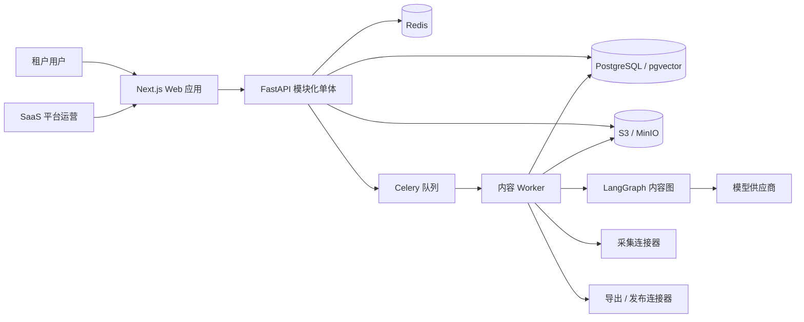

# 方案总览

## 1. 建设目标

建设面向小团队的 SaaS 内容生产平台，将采集素材加工为微信公众号文章和
小红书发布包。同一工作流可由租户配置为全自动、全人工，或者在指定节点
插入人工审核。

首版打通一条完整纵向链路：

```text
采集 -> 分析 -> 选题 -> Brief -> 大纲 -> 分段写作
-> 质量检查 -> 平台适配 -> 审核 -> 导出发布包
```

官方发布连接器属于可选能力。平台账号不具备授权发布接口时，工作流以
导出发布包结束，不使用非官方浏览器自动化代替官方接口。

## 2. 已确认决策

| 领域 | 决策 |
|---|---|
| 产品形态 | SaaS 多租户，支持租户、工作空间/品牌、团队和平台账号范围 |
| 应用形态 | 模块化单体，加独立异步 Worker |
| API | FastAPI，输入、输出和产物使用 Pydantic Schema |
| Agent 工作流 | LangGraph 负责单篇内容内部的 AI 图执行 |
| 异步执行 | 首版使用 Celery/Redis，暂缓 Temporal |
| 业务真相源 | PostgreSQL 保存业务状态、版本、审批、配额和审计 |
| 检索 | 需要语义检索时使用 PostgreSQL/pgvector |
| 文件 | S3 兼容对象存储，本地开发使用 MinIO |
| 前端 | Next.js + TipTap，支持章节编辑和平台预览 |
| 租户隔离 | 共享 Schema、强制 `tenant_id`，PostgreSQL RLS 作为第二道防线 |
| 授权 | 集中式资源/动作授权，同时判断数据范围和工作流状态 |
| 自动化 | 节点级执行策略，提供全自动、人机协同、全人工和自定义预设 |
| 配置 | 系统限制、套餐、租户、工作空间、模板、运行快照逐层解析 |
| 发布 | 首版导出优先；自动发布必须经过授权连接器和质量门禁 |

## 3. 系统上下文



## 4. 领域边界

- **身份与租户**：租户、用户、团队、角色、成员关系和登录会话。
- **品牌工作空间**：品牌风格、内容规则、平台账号和共享素材。
- **采集**：来源连接器、采集批次、来源快照、解析和去重。
- **内容生产**：选题、Brief、大纲、结构化文章、平台变体和引用。
- **工作流**：模板、节点策略、运行、节点尝试、人工任务、转换和检查点。
- **审核与发布**：审批决定、批准版本、发布包、发布尝试和状态对账。
- **AI 运营**：供应商目录、租户凭证、路由、Prompt 版本、模型调用和成本。
- **治理**：配额、审计、通知、保留策略和租户配置。

模块只能通过对方公开的应用接口访问其他模块，不允许直接更新其他模块的表。

## 5. 状态与执行职责

首版必须保持唯一状态职责：

- `ContentRun` 保存单篇内容对外展示和业务判断的生命周期状态。
- `NodeRun` 保存节点执行事实；`ArtifactVersion` 单独保存产物新鲜度。
- `WorkflowRun` 只保存 LangGraph 模板、策略快照和 checkpoint 技术记录。
- PostgreSQL 保存所有持久业务状态和节点结果。
- Celery 只负责投递可执行任务，不拥有业务状态。
- LangGraph 只计算和执行单篇内容图，不拥有租户、审批和发布生命周期。
- 人工审核不会占用 Worker；运行进入等待状态，审批后以新命令恢复。
- Redis 不是事实源，Redis 丢失不能造成业务状态丢失。

模型调用、采集、导出和发布均属于外部副作用，必须使用幂等键并保存尝试记录。

## 6. 自动化策略

每个节点使用一种执行模式：

| 模式 | 行为 |
|---|---|
| `AUTO_CONTINUE` | 自动执行，通过退出门禁后继续 |
| `AUTO_REVIEW` | 自动执行，保存结果后创建阻塞人工任务 |
| `MANUAL` | 创建人工输入任务，提交的产物作为节点输出 |
| `SKIP` | 记录跳过原因，并执行节点定义的透传逻辑 |
| `DISABLED` | 在模板编译时排除该节点 |

租户管理员配置模板，运营人员只能在系统和租户允许范围内选择模板或覆盖节点。
运行启动时保存不可变策略快照，后续配置变化不影响已启动运行。

## 7. 产物与版本不变量

1. 采集集合、分析、选题、Brief、大纲、文章、平台变体、检查报告和发布包都是产物。
2. 编辑必须创建不可变新版本，不覆盖已批准或 AI 生成版本。
3. 派生版本必须记录生成时使用的全部上游版本 ID。
4. 上游当前版本变化时，受影响的下游活动版本标记为 `STALE`。
5. 用户必须显式选择重算、返工或从旧版本创建分支。
6. 审批只绑定一个不可变版本；版本替换后原审批不能自动转移。
7. AI 修改和人工修改必须可区分、可追溯。
8. `STALE` 版本可以作为返工输入，但不能直接导出或发布。

## 8. 租户与授权不变量

1. 租户上下文来自服务端验证后的登录会话，不能信任请求体中的 `tenant_id`。
2. 租户业务记录、对象路径、向量记录、异步任务、Trace 和密钥引用都携带租户范围。
3. 后端授权同时判断资源、动作、数据范围、所有权、工作流状态和职责分离。
4. 前端权限控制只改善体验，不构成安全边界。
5. 模型和平台凭证通过密钥管理服务加密，创建后不得明文返回。
6. 跨租户平台管理使用独立授权路径，并强制写入审计。

## 9. 配置解析

有效配置按以下顺序解析：

```text
系统硬限制
  > 套餐限制
    > 租户策略
      > 工作空间/品牌策略
        > 工作流模板
          > 允许的单次运行覆盖
```

下级不能突破上级禁用项和硬配额。关键配置使用强类型表，JSON 只承载
供应商或节点类型特有的扩展字段。最终解析结果保存为不可变
`workflow_policy_snapshot`，不复制任何密钥值。

## 10. 首版容量目标

- 20 至 50 个租户。
- 每租户 5 至 20 个用户。
- 全平台每日最多完成约 500 篇文章。
- 同时执行 20 至 50 个节点。
- 单篇内容最多关联 50 个来源。
- 单篇工作流最多约 30 个节点。

这些是容量设计基线，不代表租户无限使用。Worker 并发、租户配额、供应商限流
和费用预算分别执行。

## 11. 明确暂缓

- 微服务和 Kubernetes。
- Temporal 编排。
- 拖拽式工作流设计器。
- 独立向量数据库。
- 多 Agent 自由对话。
- 非官方浏览器自动发布。
- 在线支付和复杂账单结算。
- 普通租户独立数据库；仅作为未来企业套餐能力。

## 12. 进入实现的条件

- 数据模型能够表达所有产物、版本、依赖、人工任务、审批、发布尝试和租户边界。
- 状态机覆盖正常、重试、暂停、取消、驳回、失效和恢复路径。
- API 命令明确授权、幂等和错误语义。
- 前端明确加载、空数据、冲突、等待、失效、失败和无权限状态。
- MVP 里程碑具有可执行验收测试和上线回退路径。

