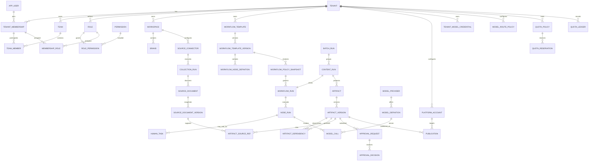

# AI 内容生产平台：领域与数据模型设计

> 状态：首版设计基线  
> 目标规模：小团队 SaaS，多租户共享部署，约 20-50 个租户、500 篇文章/日以内  
> 数据库：PostgreSQL 16+；主键使用 UUIDv7（应用生成），时间统一存 `timestamptz`（UTC）

## 1. 设计原则

1. **租户隔离优先**：所有租户业务数据必须携带 `tenant_id`，应用授权与 PostgreSQL RLS 双重隔离。
2. **产物不可变、引用版本**：采集快照、选题、Brief、大纲、正文、平台稿均以版本保存；审批和发布永远绑定具体版本。
3. **流程状态与内容产物分离**：工作流记录“执行到哪里”，Artifact 记录“产生了什么”，二者不互相替代。
4. **全自动与人工介入共用一套模型**：节点执行模式是配置，人工修改产生新版本，不建立另一套人工流程。
5. **强类型配置优先**：配额、来源、模型路由、发布和审批策略使用独立表与明确字段，不建设万能 EAV 表。
6. **JSONB 有边界**：仅用于版本化结构化产物、供应商特有参数和不可预知的外部响应；必须有 `schema_name/schema_version` 或应用 Schema 校验。
7. **可靠副作用**：外部调用使用幂等键；数据库状态与异步事件通过 Transactional Outbox 保持一致。
8. **审计不可覆盖**：关键操作只追加审计记录，保留操作者、对象版本、前后差异和请求链路。

## 2. 领域边界

| 限界上下文 | 职责 | 核心聚合 |
|---|---|---|
| 租户与身份 | 租户、套餐、用户、团队、成员关系 | `Tenant`、`User`、`Team` |
| 授权 | RBAC、数据范围、资源授权 | `Role`、`PermissionGrant` |
| 工作空间与品牌 | 内容空间、品牌规范、栏目 | `Workspace`、`Brand` |
| 来源与采集 | 来源连接、采集批次、原始快照、清洗去重 | `SourceConnector`、`SourceDocument`、`CollectionRun` |
| 内容生产 | 内容任务、版本化产物、版本依赖 | `ContentRun`、`Artifact` |
| 工作流 | 模板、节点策略、实例、节点执行、人工任务 | `WorkflowTemplate`、`WorkflowRun` |
| 审批 | 提交、批准、驳回、评论、版本锁定 | `ApprovalRequest` |
| 平台交付 | 平台账号、平台稿、发布包、发布记录 | `PlatformAccount`、`Publication` |
| AI 治理 | 供应商、凭证、模型、路由、Prompt、调用记录 | `ModelProvider`、`ModelRoute`、`PromptTemplate` |
| 配额计量 | 套餐上限、租户策略、预占、使用与成本 | `QuotaPolicy`、`QuotaLedger` |
| 可靠性与审计 | 幂等、Outbox、操作审计 | `IdempotencyRecord`、`OutboxEvent`、`AuditEvent` |

### 2.1 聚合边界和一致性规则

- `Tenant` 是租户配置根；停用租户后禁止新任务、模型调用和发布，但历史数据仍可只读访问。
- `WorkflowTemplateVersion` 发布后不可修改；运行实例保存模板版本及策略快照。
- `ContentRun` 是单篇内容生产根；批次 `BatchRun` 仅组织多个 `ContentRun`，单篇失败不回滚整个批次。
- `Artifact` 是逻辑产物，`ArtifactVersion` 是不可变事实；修改等于创建新版本并切换 `current_version_id`。
- `ApprovalRequest` 只能绑定一个明确的 `artifact_version_id`；该版本变化后旧审批不自动转移。
- `Publication` 只能使用已满足发布策略的 `platform_variant` 版本；外部平台 ID 在租户平台账号内唯一。
- 配额先预占后结算；任务失败按指标策略决定释放或计费，禁止“先查后加”的并发竞态。

## 3. 核心实体关系



> Mermaid 省略了多数审计字段和部分关联表，以保持可读性；物理表定义以下文为准。

## 4. PostgreSQL 物理模型约定

### 4.1 通用字段

租户业务表默认包含：

```sql
id              uuid primary key,
tenant_id       uuid not null,
created_at      timestamptz not null default now(),
created_by      uuid null,
updated_at      timestamptz not null default now(),
updated_by      uuid null,
row_version     bigint not null default 0
```

- `row_version` 用于乐观锁；更新语句必须包含 `WHERE id = ? AND row_version = ?`。
- 高频业务表不做物理软删除；需要撤销时使用明确状态。管理类配置可增加 `deleted_at/deleted_by`。
- 状态字段使用 `text + CHECK` 或受控字典，不用 PostgreSQL ENUM，避免部署期枚举迁移锁定。
- 金额统一使用 `numeric(20,8)` 加三位 `currency_code`；Token/次数使用 `bigint`。
- 全局表不含 `tenant_id`：`app_user`、`permission`、`model_provider`、`model_definition`、`plan`。

### 4.2 跨租户外键规则

只写 `FOREIGN KEY (parent_id)` 不能防止错误引用其他租户的数据。每个被租户内引用的父表必须额外具备：

```sql
UNIQUE (tenant_id, id)
```

子表使用复合外键：

```sql
FOREIGN KEY (tenant_id, parent_id)
  REFERENCES parent_table (tenant_id, id)
```

所有租户内唯一约束必须把 `tenant_id` 放在第一列，例如 `UNIQUE (tenant_id, code)`。

## 5. 表清单与关键字段

以下字段省略通用审计列。标注 `FK(T)` 表示必须实现为 `(tenant_id, id)` 复合外键。

### 5.1 租户、身份与授权

#### `tenant`

- 字段：`id`、`code`、`name`、`status`、`timezone`、`locale`、`data_region`、`plan_id`、`settings_version`。
- 约束：`UNIQUE(code)`；`status CHECK IN ('ACTIVE','SUSPENDED','CLOSED')`。
- 索引：`(status)`、`(plan_id)`。

#### `plan`、`tenant_subscription`

- `plan`：`id`、`code`、`name`、`status`、明确的套餐上限字段，如 `max_users/max_workspaces/max_daily_articles`。
- `tenant_subscription`：`tenant_id`、`plan_id`、`status`、`starts_at`、`ends_at`、`grace_ends_at`。
- 约束：每租户同一时刻只允许一个有效订阅，由排斥约束或事务锁保证；首版可用部分唯一索引限制 `ACTIVE`。

#### `app_user`

- 字段：`id`、`email`、`phone`、`password_hash`、`display_name`、`status`、`mfa_enabled`、`last_login_at`。
- 约束：大小写不敏感邮箱唯一，推荐 `citext`：`UNIQUE(email)`；手机号按规范化值唯一。
- 注意：用户是平台身份，不直接携带 `tenant_id`；其租户身份由成员表定义。

#### `tenant_membership`

- 字段：`tenant_id`、`user_id`、`status`、`member_no`、`job_title`、`joined_at`。
- 约束：`UNIQUE(tenant_id,user_id)`、`UNIQUE(tenant_id,id)`。
- 索引：`(user_id,status)`、`(tenant_id,status)`。

#### `team`、`team_member`

- `team`：`tenant_id`、`parent_team_id`、`code`、`name`、`status`；`UNIQUE(tenant_id,code)`。
- `team_member`：`tenant_id`、`team_id FK(T)`、`membership_id FK(T)`、`is_manager`。
- 约束：`UNIQUE(tenant_id,team_id,membership_id)`；团队树首版由应用防环，后续可增加 closure table。

#### `role`、`permission`、`role_permission`、`membership_role`

- `role`：`tenant_id`、`code`、`name`、`is_system`、`status`；`UNIQUE(tenant_id,code)`。
- `permission`：全局权限目录，字段 `code`、`resource_type`、`action`、`risk_level`；`UNIQUE(code)`。
- `role_permission`：`tenant_id`、`role_id FK(T)`、`permission_id`；三列唯一。
- `membership_role`：`tenant_id`、`membership_id FK(T)`、`role_id FK(T)`、`workspace_id`（可空）、`valid_from/valid_until`。
- 索引：`membership_role(tenant_id,membership_id,valid_until)`。

#### `role_data_scope`

- 字段：`tenant_id`、`role_id FK(T)`、`resource_type`、`scope_type`、`workspace_id`、`team_id`。
- `scope_type CHECK IN ('TENANT','WORKSPACE','TEAM','ASSIGNED','OWNED')`。
- 自定义对象授权后续使用独立的 `resource_grant` 表，首版不以 JSON/EAV 模拟复杂策略。

### 5.2 工作空间与品牌

#### `workspace`

- 字段：`tenant_id`、`code`、`name`、`status`、`default_brand_id`、`created_by_membership_id`。
- 约束：`UNIQUE(tenant_id,code)`；`default_brand_id` 延迟添加复合外键，解决品牌反向引用。
- 索引：`(tenant_id,status)`。

#### `brand`

- 字段：`tenant_id`、`workspace_id FK(T)`、`name`、`description`、`tone_guideline`、`prohibited_terms`（`text[]`）、`default_language`、`status`。
- 约束：`UNIQUE(tenant_id,workspace_id,name)`。
- 说明：品牌规则首版直接强类型存储；复杂风格规范可作为 `BRAND_GUIDE` Artifact 版本化。

### 5.3 来源与采集

#### `source_policy`

- 字段：`tenant_id`、`workspace_id FK(T)`、`allowed_source_types text[]`、`allowed_domains text[]`、`blocked_domains text[]`、`max_items_per_day`、`max_depth`、`retention_days`、`require_review`、`respect_robots`、`copyright_policy`、`status`。
- 约束：每工作空间一个当前策略：`UNIQUE(tenant_id,workspace_id)`。
- 说明：全局 SSRF 禁止网段和平台禁用域名属于系统配置，不允许租户覆盖。

#### `source_connector`

- 字段：`tenant_id`、`workspace_id FK(T)`、`source_policy_id FK(T)`、`type`、`name`、`base_url`、`schedule_cron`、`credential_ref`、`status`、`last_cursor`、`last_run_at`。
- `type CHECK IN ('MANUAL_URL','RSS','FILE_UPLOAD','API')`。
- 约束：`UNIQUE(tenant_id,workspace_id,name)`。
- 索引：`(tenant_id,status,last_run_at)`。

#### `collection_run`

- 字段：`tenant_id`、`connector_id FK(T)`、`status`、`trigger_type`、`started_at`、`finished_at`、`cursor_before/after`、`discovered_count`、`accepted_count`、`failed_count`、`error_code`、`error_detail`。
- 索引：`(tenant_id,connector_id,created_at DESC)`、运行中任务的部分索引。

#### `source_document`

- 字段：`tenant_id`、`workspace_id FK(T)`、`connector_id FK(T)`、`canonical_url`、`url_hash`、`external_key`、`mime_type`、`language`、`trust_level`、`status`、`current_version_id`。
- 约束：`UNIQUE(tenant_id,workspace_id,url_hash)`；没有 URL 时用 `external_key` 的部分唯一索引。
- 索引：`(tenant_id,workspace_id,status,created_at DESC)`。

#### `source_document_version`

- 字段：`tenant_id`、`source_document_id FK(T)`、`version_no`、`title`、`author`、`published_at`、`raw_object_key`、`clean_text`、`content_hash`、`metadata jsonb`、`fetched_at`、`created_by_type`。
- 约束：`UNIQUE(tenant_id,source_document_id,version_no)`、`UNIQUE(tenant_id,source_document_id,content_hash)`。
- 索引：全文检索 GIN（`to_tsvector` 的生成列）、`(tenant_id,content_hash)`。
- 规则：原始抓取快照不可被人工覆盖；人工修订创建新版本并标记 `created_by_type='HUMAN'`。

### 5.4 工作流模板与执行

#### `workflow_template`、`workflow_template_version`

- `workflow_template`：`tenant_id`、`workspace_id`（可空表示租户通用）、`code`、`name`、`status`、`current_version_id`。
- `workflow_template_version`：`tenant_id`、`template_id FK(T)`、`version_no`、`status`、`description`、`published_at`、`published_by`。
- 约束：模板 `UNIQUE(tenant_id,workspace_id,code)`；版本 `UNIQUE(tenant_id,template_id,version_no)`。
- 发布版本不可更新，只能创建下一版本。

#### `workflow_node_definition`

- 字段：`tenant_id`、`template_version_id FK(T)`、`node_key`、`node_type`、`execution_mode`、`sequence_no`、`timeout_seconds`、`max_attempts`、`approval_policy_id`、`model_route_policy_id`、`input_schema_name/version`、`output_schema_name/version`、`config jsonb`。
- `execution_mode CHECK IN ('AUTO_CONTINUE','AUTO_REVIEW','MANUAL','SKIP','DISABLED')`。
- 约束：`UNIQUE(tenant_id,template_version_id,node_key)`。
- `config` 仅承载节点类型专属参数，按 `node_type` 进行 Pydantic/JSON Schema 校验。

#### `workflow_edge_definition`

- 字段：`tenant_id`、`template_version_id FK(T)`、`from_node_key`、`to_node_key`、`condition_type`、`condition_expression`、`priority`。
- 约束：边唯一；节点发布时校验引用、无意外循环和可达性。
- 首版 `condition_type` 仅支持白名单规则，不允许执行任意 Python/SQL。

#### `workflow_policy_snapshot`

- 字段：`tenant_id`、`workspace_id FK(T)`、`template_version_id FK(T)`、`schema_version`、`content_hash`、`resolved_policy jsonb`、`source_version_refs jsonb`、`created_by_membership_id`、`created_at`。
- 快照保存节点模式、模型路由、审批、配额、采集、质量和发布策略的最终解析结果，但绝不保存密钥值。
- 约束：`UNIQUE(tenant_id,id)`、`UNIQUE(tenant_id,content_hash)`；写入后不可修改，相同解析结果可复用同一快照。
- `resolved_policy` 是运行时不可变快照，不是关键配置的编辑入口；可编辑配置仍由对应强类型策略表管理。

#### `batch_run`

- 字段：`tenant_id`、`workspace_id FK(T)`、`name`、`status`、`outcome`、`template_version_id FK(T)`、`policy_snapshot_id FK(T)`、`requested_count`、`completed_count`、`failed_count`、`max_concurrency`、`pause_requested_at`、`cancel_requested_at`、`row_version`、`started_at`、`finished_at`。
- 状态：`DRAFT/RUNNING/WAITING_HUMAN/PAUSED/COMPLETED/FAILED/CANCELLED`。
- 索引：`(tenant_id,workspace_id,status,created_at DESC)`。

#### `content_run`

- 字段：`tenant_id`、`workspace_id FK(T)`、`brand_id FK(T)`、`batch_run_id FK(T)`（可空）、`title`、`business_stage`、`status`、`outcome`、`priority`、`assignee_membership_id`、`pause_requested_at`、`cancel_requested_at`、`row_version`、`created_by_membership_id`。
- 状态：`DRAFT/RUNNING/WAITING_HUMAN/PAUSED/COMPLETED/FAILED/CANCELLED`。
- `content_run.status` 是单篇内容对外展示和业务判断的唯一生命周期状态；`business_stage` 仅表示当前内容阶段。
- 索引：工作台 `(tenant_id,workspace_id,status,assignee_membership_id,updated_at DESC)`；批次 `(tenant_id,batch_run_id)`。

#### `workflow_run`

- 字段：`tenant_id`、`content_run_id FK(T)`、`template_version_id FK(T)`、`policy_snapshot_id FK(T)`、`graph_thread_id`、`checkpoint_ref`、`cursor_summary jsonb`、`row_version`、`created_at`、`updated_at`。
- 约束：首版 `UNIQUE(tenant_id,content_run_id)`；关联方向只保留 `workflow_run.content_run_id`，避免双向外键。
- `workflow_run` 只保存 LangGraph 技术执行信息，不另设业务生命周期状态；业务状态只读取 `content_run.status`。
- `cursor_summary` 仅用于诊断和对账，并行节点的真实状态以 `node_run` 为准。

#### `node_run`

- 字段：`tenant_id`、`workflow_run_id FK(T)`、`node_key`、`attempt_no`、`status`、`execution_mode_snapshot`、`input_fingerprint`、`idempotency_key`、`infrastructure_retry_count`、`next_retry_at`、`timeout_at`、`started_at`、`finished_at`、`worker_task_id`、`row_version`、`error_code/detail`、`output_artifact_version_id`。
- 状态：`PENDING/RUNNING/AWAITING_REVIEW/COMPLETED/FAILED/SKIPPED/CANCELLED`；产物是否过期由 Artifact 版本的新鲜度表示，不混入执行状态。
- 约束：`UNIQUE(tenant_id,workflow_run_id,node_key,attempt_no)`。
- 索引：待执行部分索引、`(tenant_id,workflow_run_id,node_key,attempt_no DESC)`。

#### `human_task`

- 字段：`tenant_id`、`content_run_id FK(T)`、`node_run_id FK(T)`、`task_type`、`status`、`assignee_type`、`assignee_membership_id`、`assignee_team_id`、`claimed_by`、`lease_expires_at`、`due_at`、`completed_at`、`decision`、`comment`、`artifact_version_id FK(T)`、`expected_content_hash`、`row_version`。
- 状态：`OPEN/CLAIMED/COMPLETED/CANCELLED/EXPIRED`。
- `EDIT_AND_APPROVE` 是 HumanTask 决策：系统先创建人工产物版本，再对该新版本写入标准 `APPROVE` 审批决定。
- 约束：每个等待中的节点最多一个开放任务，使用部分唯一索引 `WHERE status IN ('OPEN','CLAIMED')`。
- 索引：个人待办 `(tenant_id,assignee_membership_id,status,due_at)`、团队待办 `(tenant_id,assignee_team_id,status,due_at)`。

### 5.5 Artifact、版本与依赖

#### `artifact`

- 字段：`tenant_id`、`content_run_id FK(T)`、`artifact_type`、`logical_key`、`status`、`current_version_id`、`created_from_node_key`。
- `artifact_type` 首版固定为：`SOURCE_SET/TOPIC_ANALYSIS/TOPIC/BRIEF/OUTLINE/ARTICLE_MASTER/PLATFORM_VARIANT/CHECK_REPORT/PUBLISH_PACKAGE`。
- `logical_key` 用于区分同类产物，例如 `article-master`、`platform:wechat`、`section:<uuid>`。
- 约束：`UNIQUE(tenant_id,content_run_id,artifact_type,logical_key)`。

#### `artifact_version`

- 字段：`tenant_id`、`artifact_id FK(T)`、`version_no`、`lifecycle_status`、`freshness_status`、`stale_reason`、`schema_name`、`schema_version`、`payload jsonb`、`content_hash`、`change_type`、`change_summary`、`based_on_node_run_id`、`created_by_type`、`created_by_membership_id`、`locked_at/by`、`supersedes_version_id`。
- `lifecycle_status CHECK IN ('ACTIVE','SUPERSEDED','REJECTED','ARCHIVED')`；`freshness_status CHECK IN ('FRESH','STALE')`。
- `created_by_type CHECK IN ('AI','HUMAN','IMPORT','SYSTEM')`。
- 约束：`UNIQUE(tenant_id,artifact_id,version_no)`；同一 Artifact 只允许一个 `ACTIVE`（部分唯一索引），且必须与 `artifact.current_version_id` 一致。
- 索引：`(tenant_id,artifact_id,created_at DESC)`、`(tenant_id,freshness_status,updated_at)`、必要字段的 JSONB 表达式索引，不默认对整个 payload 建 GIN。
- `payload`、Schema、哈希、创建者和上游依据写入后不可修改；仅生命周期、新鲜度和锁定元数据可按状态机更新。

`payload` 并非万能属性表，而是有明确 Schema 的领域文档。示例：

```json
{
  "schema": "article_master/v1",
  "title": "示例标题",
  "summary": "示例摘要",
  "sections": [
    {
      "section_id": "019...",
      "heading": "章节标题",
      "content": [{"type": "paragraph", "text": "正文"}],
      "citation_ref_ids": ["019..."],
      "locked": false
    }
  ]
}
```

列表筛选需要的标题、平台、语言、状态等字段应同步投影到强类型列或查询投影表，不依赖任意 JSON 路径查询。

#### `artifact_dependency`

- 字段：`tenant_id`、`downstream_version_id FK(T)`、`upstream_version_id FK(T)`、`dependency_type`、`scope_key`、`created_at`。
- `dependency_type CHECK IN ('DERIVED_FROM','CITES','VALIDATES','ADAPTS')`。
- 约束：`UNIQUE(tenant_id,downstream_version_id,upstream_version_id,dependency_type,scope_key)`；禁止自依赖。
- 索引：`(tenant_id,upstream_version_id)` 用于向下失效传播，`(tenant_id,downstream_version_id)` 用于追溯来源。
- `scope_key` 可表示 `section:<id>`，用于只失效受影响章节；它不是任意属性存储。

#### `artifact_source_ref`

- 字段：`tenant_id`、`artifact_version_id FK(T)`、`source_document_version_id FK(T)`、`section_id`、`quote_text`、`locator`、`usage_type`、`verification_status`。
- 约束：防止重复引用的组合唯一约束；`verification_status` 为 `UNVERIFIED/VERIFIED/DISPUTED`。
- 索引：`(tenant_id,artifact_version_id)`、`(tenant_id,source_document_version_id)`。

### 5.6 版本切换与失效传播事务

人工或 AI 修改产物时，在单个数据库事务中：

1. 锁定 `artifact` 行，读取下一个 `version_no`。
2. 插入新的 `artifact_version`（`ACTIVE/FRESH`），旧版本改为 `SUPERSEDED`，更新 `artifact.current_version_id`。
3. 写入新版本的 `artifact_dependency` 和来源引用。
4. 递归查询依赖旧版本的下游活动版本，将 `freshness_status` 标记为 `STALE`，但不删除、不覆盖，`current_version_id` 仍指向该最新选中版本。
5. 将绑定受影响版本且未完成的审批取消；已批准记录保留，并将批准版本标为不再是当前版本。
6. 写入 `audit_event` 和 `outbox_event`。

递归传播使用 `WITH RECURSIVE`；事务内设置最大深度并在模板发布时阻止依赖环。重新执行时必须显式创建新版本，不允许直接把旧版本的 `freshness_status` 改回 `FRESH` 来伪造重算。

## 6. 审批、发布与审计

### 6.1 审批

#### `approval_policy`

- 字段：`tenant_id`、`workspace_id`、`name`、`required_approvals`、`prohibit_self_approval`、`require_distinct_editor_publisher`、`allow_batch`、`status`。
- 审批人范围使用 `approval_policy_role` 关联角色，不把角色 ID 数组塞进 JSON。

#### `approval_request`

- 字段：`tenant_id`、`content_run_id FK(T)`、`artifact_version_id FK(T)`、`policy_id FK(T)`、`status`、`submitted_by`、`submitted_at`、`resolved_at`、`expires_at`。
- 状态：`PENDING/APPROVED/REJECTED/CANCELLED/EXPIRED`。
- 约束：同一产物版本和策略最多一个进行中的请求（部分唯一索引）。
- 索引：`(tenant_id,status,submitted_at)`、`(tenant_id,artifact_version_id)`。

#### `approval_decision`

- 字段：`tenant_id`、`request_id FK(T)`、`reviewer_membership_id`、`decision`、`comment`、`decided_at`、`artifact_version_hash`。
- 约束：`UNIQUE(tenant_id,request_id,reviewer_membership_id)`；`decision IN ('APPROVE','REJECT','REQUEST_CHANGES')`。
- 服务层同时检查 RBAC、数据范围、流程状态、自审限制与版本哈希。

### 6.2 平台账号、导出和发布

#### `publishing_policy`

- 字段：`tenant_id`、`workspace_id`、`platform`、`mode`、`required_quality_score`、`require_approval`、`max_auto_retries`、`fallback_to_manual`、`status`。
- `mode`：`MANUAL_EXPORT/APPROVAL_THEN_EXPORT/APPROVAL_THEN_PUBLISH/SCHEDULED_AFTER_APPROVAL/FULL_AUTO`。
- 约束：`UNIQUE(tenant_id,workspace_id,platform)`。

#### `platform_account`

- 字段：`tenant_id`、`workspace_id FK(T)`、`platform`、`display_name`、`external_account_id`、`credential_ref`、`capability_publish`、`status`、`token_expires_at`。
- 约束：`UNIQUE(tenant_id,platform,external_account_id)`。
- 凭证只存密钥管理系统引用，不存明文 Token。

#### `publication`

- 字段：`tenant_id`、`content_run_id FK(T)`、`artifact_version_id FK(T)`、`platform_account_id FK(T)`、`mode`、`status`、`scheduled_at`、`published_at`、`external_post_id`、`external_url`、`idempotency_key`、`attempt_count`、`last_error`。
- 状态：`DRAFT/READY/SCHEDULED/PUBLISHING/PUBLISHED/FAILED/CANCELLED`。
- 约束：`UNIQUE(tenant_id,platform_account_id,idempotency_key)`；外部文章 ID 非空时唯一。
- 索引：待发布部分索引 `(tenant_id,scheduled_at) WHERE status='SCHEDULED'`。

#### `export_package`

- 字段：`tenant_id`、`publication_id FK(T)`（可空）、`artifact_version_id FK(T)`、`format`、`object_key`、`checksum`、`expires_at`。
- 约束：相同版本、格式和校验和去重；对象路径强制以 `tenant_id/workspace_id/` 为前缀。

### 6.3 审计

#### `audit_event`

- 字段：`id`（UUIDv7）、`tenant_id`、`occurred_at`、`actor_type`、`actor_id`、`action`、`resource_type`、`resource_id`、`resource_version_id`、`request_id`、`trace_id`、`ip_hash`、`user_agent`、`reason`、`before_data jsonb`、`after_data jsonb`、`metadata jsonb`。
- 规则：只允许 `INSERT/SELECT`；应用角色无 `UPDATE/DELETE` 权限。敏感字段写入前脱敏。
- 索引：`(tenant_id,occurred_at DESC)`、`(tenant_id,resource_type,resource_id,occurred_at DESC)`、`(trace_id)`。
- 后续可按月分区并周期性导出到不可变对象存储。

## 7. 模型、Prompt、配额与成本

### 7.1 模型和 Prompt

#### `model_provider`、`model_definition`

- `model_provider`：全局表，字段 `code`、`name`、`api_style`、`status`、`base_url_policy`。
- `model_definition`：全局表，字段 `provider_id`、`model_code`、`capability_type`、`context_window`、`supports_structured_output`、`input_price_per_million`、`output_price_per_million`、`currency_code`、`price_effective_from/to`、`status`。
- 约束：模型价格需要按有效期版本化，不能直接覆盖历史价格。

#### `tenant_model_credential`

- 字段：`tenant_id`、`provider_id`、`name`、`credential_ref`、`ownership_type`（`PLATFORM/BYOK`）、`status`、`last_verified_at`。
- 约束：`UNIQUE(tenant_id,provider_id,name)`。

#### `model_route_policy`、`model_route_candidate`

- `model_route_policy`：`tenant_id`、`workspace_id`（可空）、`task_type`、`name`、`daily_cost_limit`、`per_call_timeout_seconds`、`status`。
- `model_route_candidate`：`tenant_id`、`policy_id FK(T)`、`priority`、`model_definition_id`、`credential_id FK(T)`、`temperature`、`max_output_tokens`、`allowed_for_publish`。
- 约束：`UNIQUE(tenant_id,policy_id,priority)`；一个任务类型可有主模型和有限个降级模型。

#### `prompt_template`、`prompt_version`

- `prompt_template`：`tenant_id`、`workspace_id`、`code`、`task_type`、`name`、`status`。
- `prompt_version`：`tenant_id`、`template_id FK(T)`、`version_no`、`system_prompt`、`user_prompt_template`、`input_schema_name/version`、`output_schema_name/version`、`status`、`published_at/by`。
- 发布版本不可修改；工作流节点和模型调用记录均引用明确版本。

#### `model_call`

- 字段：`tenant_id`、`node_run_id FK(T)`、`content_run_id FK(T)`、`provider_id`、`model_definition_id`、`credential_id FK(T)`、`prompt_version_id FK(T)`、`request_fingerprint`、`status`、`started_at/finished_at`、`input_tokens`、`cached_input_tokens`、`output_tokens`、`reasoning_tokens`、`cost_amount`、`currency_code`、`provider_request_id`、`retry_of_call_id`、`error_code`。
- 约束：供应商请求 ID 非空时租户内唯一；`cost_amount >= 0`。
- 索引：`(tenant_id,created_at DESC)`、`(tenant_id,content_run_id)`、`(tenant_id,status,created_at)`。
- 成本使用调用发生时匹配的价格快照计算并落账，不用当前价格回算历史。

### 7.2 配额

#### `quota_policy`

- 字段：`tenant_id`、`metric`、`period_type`、`soft_limit`、`hard_limit`、`overage_allowed`、`timezone`、`effective_from/to`、`status`。
- 指标首版：`ARTICLES_GENERATED/ARTICLES_PUBLISHED/SOURCES_COLLECTED/INPUT_TOKENS/OUTPUT_TOKENS/AI_COST/MAX_CONCURRENT_RUNS`。
- 约束：同一指标和有效期不可重叠；租户策略不能突破套餐硬上限。

#### `quota_reservation`

- 字段：`tenant_id`、`policy_id FK(T)`、`subject_type`、`subject_id`、`period_start/end`、`amount`、`status`、`expires_at`、`settled_amount`。
- 状态：`RESERVED/SETTLED/RELEASED/EXPIRED`。
- 约束：`UNIQUE(tenant_id,policy_id,subject_type,subject_id)`，支持幂等预占。
- 预占必须在同一事务中锁定对应计量桶，避免并发超额。

#### `quota_ledger`、`quota_usage_bucket`

- `quota_ledger`：只追加流水，字段 `tenant_id`、`metric`、`amount`、`direction`、`subject_type/id`、`reservation_id`、`occurred_at`、`period_start/end`、`idempotency_key`。
- `quota_usage_bucket`：汇总投影，字段 `tenant_id`、`metric`、`period_start/end`、`reserved_amount`、`used_amount`、`row_version`。
- 约束：流水 `UNIQUE(tenant_id,metric,idempotency_key)`；桶 `UNIQUE(tenant_id,metric,period_start)`。
- 账本是真相源，桶可重建；租户时区仅用于计算周期边界，时间仍以 UTC 存储。

## 8. Outbox、幂等与任务可靠性

### 8.1 `outbox_event`

- 字段：`id`、`tenant_id`、`aggregate_type`、`aggregate_id`、`event_type`、`payload jsonb`、`occurred_at`、`available_at`、`status`、`attempt_count`、`locked_by/at`、`published_at`、`last_error`。
- 索引：`(status,available_at)` 的待发送部分索引、`(tenant_id,aggregate_type,aggregate_id,occurred_at)`。
- 与业务变更同事务插入；Dispatcher 使用 `FOR UPDATE SKIP LOCKED` 拉取。
- 消费端仍须幂等，Outbox 只保证至少一次投递，不承诺恰好一次。

### 8.2 `idempotency_record`

- 字段：`tenant_id`、`scope`、`idempotency_key`、`request_hash`、`status`、`resource_type/id`、`response_code`、`response_body jsonb`、`locked_until`、`expires_at`。
- 约束：`UNIQUE(tenant_id,scope,idempotency_key)`。
- 同键不同 `request_hash` 返回冲突；发布、导出、批次创建、工作流恢复和外部回调必须使用。

### 8.3 `inbox_event`

- 字段：`tenant_id`、`consumer_name`、`event_id`、`received_at`、`processed_at`、`status`、`error_detail`。
- 约束：`UNIQUE(tenant_id,consumer_name,event_id)`，用于 MQ 和平台回调去重。

## 9. 多租户隔离与 RLS

### 9.1 RLS 基线

每个租户表启用并强制 RLS：

```sql
ALTER TABLE artifact ENABLE ROW LEVEL SECURITY;
ALTER TABLE artifact FORCE ROW LEVEL SECURITY;

CREATE POLICY artifact_tenant_isolation ON artifact
USING (tenant_id = current_setting('app.tenant_id', true)::uuid)
WITH CHECK (tenant_id = current_setting('app.tenant_id', true)::uuid);
```

请求事务开始时：

```sql
SET LOCAL app.tenant_id = '<tenant-from-verified-token>';
SET LOCAL app.membership_id = '<resolved-membership-id>';
```

- `tenant_id` 只能由服务端从已验证身份解析，禁止从请求正文信任。
- 使用连接池时必须 `SET LOCAL` 且处于事务中，防止上下文泄漏到下一请求。
- 应用数据库角色不得拥有 `BYPASSRLS`，表所有者角色不用于运行应用。
- 平台运维跨租户查询使用独立、审计化的后台角色和受控接口。
- Worker 每个任务都显式携带并验证 `tenant_id`；不存在“无租户上下文继续执行”的回退。

### 9.2 其他存储隔离

- Redis Key：`tenant:{tenant_id}:workspace:{workspace_id}:...`；限流和锁也必须带租户前缀。
- 对象存储：`tenant/{tenant_id}/workspace/{workspace_id}/...`，使用短期签名 URL。
- 向量检索后续采用同库 pgvector 时，行必须带 `tenant_id` 并强制过滤；不允许只依赖向量库 namespace 名称。
- 日志、指标和 Trace 带 `tenant_id`，正文和密钥不得进入日志。
- 租户删除采用“冻结 -> 导出 -> 延迟清除 -> 备份到期清除”的生命周期，不做立即级联删除。

## 10. 关键索引和分区策略

首版优先建立可证明有查询场景的索引：

- 所有复合外键列均建立对应索引，PostgreSQL 不会自动为外键建索引。
- 工作台列表：`content_run(tenant_id,workspace_id,status,updated_at DESC)`。
- 待办：`human_task(tenant_id,assignee_membership_id,status,due_at)`。
- 失效传播：`artifact_dependency(tenant_id,upstream_version_id)`。
- 版本读取：`artifact_version(tenant_id,artifact_id,version_no DESC)`。
- 调度：`publication(tenant_id,scheduled_at) WHERE status='SCHEDULED'`。
- Outbox：`outbox_event(available_at) WHERE status='PENDING'`。
- 审计和模型调用按 `tenant_id + created_at` 查询。

首版不预分区普通业务表。达到以下任一条件再按月对 `audit_event`、`model_call`、`quota_ledger`、`outbox_event` 分区：单表超过 5,000 万行、索引不能稳定驻留或清理窗口不可接受。分区表唯一约束必须包含分区键，迁移前需单独设计。

## 11. 删除、保留与密钥

- 业务实体默认状态关闭，不级联删除历史 Artifact、审批、发布和成本记录。
- 来源原文、模型输入输出、导出包分别配置保留期；清理任务先写审计再删除对象和数据库引用。
- `credential_ref` 指向 Vault/KMS/云 Secret Manager；数据库不保存可逆明文密钥。
- Prompt、来源、正文中可能含个人信息，审计 diff 和错误日志必须脱敏。
- 备份需验证 RLS 之外的租户恢复能力；至少执行季度恢复演练。

## 12. 首版边界

### 12.1 首版必须实现

- 共享 PostgreSQL Schema、`tenant_id`、复合外键、RLS。
- 用户、租户成员、团队、角色权限和基础数据范围。
- 工作空间、品牌、URL/RSS/文件/人工来源。
- 固定节点类型的可配置工作流模板，支持五种执行模式。
- 批次、单篇流程、节点执行、人工待办。
- Artifact 不可变版本、来源引用、依赖与下游失效传播。
- 选题、Brief、大纲、结构化文章、公众号/小红书平台稿、检查报告和发布包。
- 审批绑定版本、自审限制、修改后审批失效。
- 模型供应商目录、租户凭证、路由、Prompt 版本、调用成本。
- 每日文章、来源、Token、费用和并发配额的预占与结算。
- Markdown/HTML/ZIP 导出；具备官方权限时才启用可选发布。
- Outbox、幂等、Inbox、操作审计。

### 12.2 后续增强

- 在线支付、自动套餐变更和精细账单。
- 企业 OIDC/SCIM、MFA 强制策略、临时委托和多级会签。
- 可视化拖拽流程、动态插件节点、复杂条件表达式。
- Temporal、跨天补偿事务、跨区域灾备和独立企业数据库。
- 全网爬虫、浏览器采集和高级版权授权管理。
- pgvector 语义检索、知识库和跨文章复用。
- 自动发布到更多平台、撤回与平台双向状态同步。
- 审计分区、WORM 存储、数据仓库和成本分摊。

## 13. 实施顺序

1. 建立租户上下文、RLS 测试夹具和复合外键约定。
2. 实现身份、成员、团队、RBAC、工作空间和品牌。
3. 实现来源快照和 ContentRun/WorkflowRun 基础状态。
4. 实现 Artifact 版本、依赖、引用和失效传播事务。
5. 接入人工任务、审批和结构化文章编辑。
6. 接入模型路由、调用记录、成本与配额预占。
7. 实现平台适配、导出、可选发布及幂等。
8. 完成 Outbox、审计、保留策略和跨租户隔离测试。

数据库验收必须包含：跨租户读写拒绝、复合外键拒绝跨租户关联、并发配额不超卖、并发编辑乐观锁、失效传播正确性、审批绑定版本、发布幂等和 Outbox 重放。
