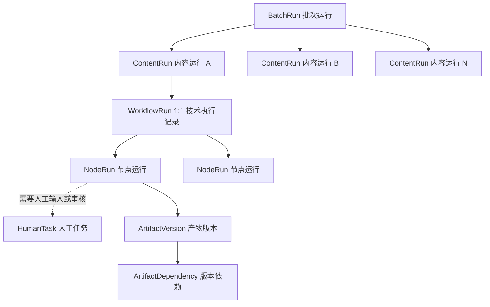
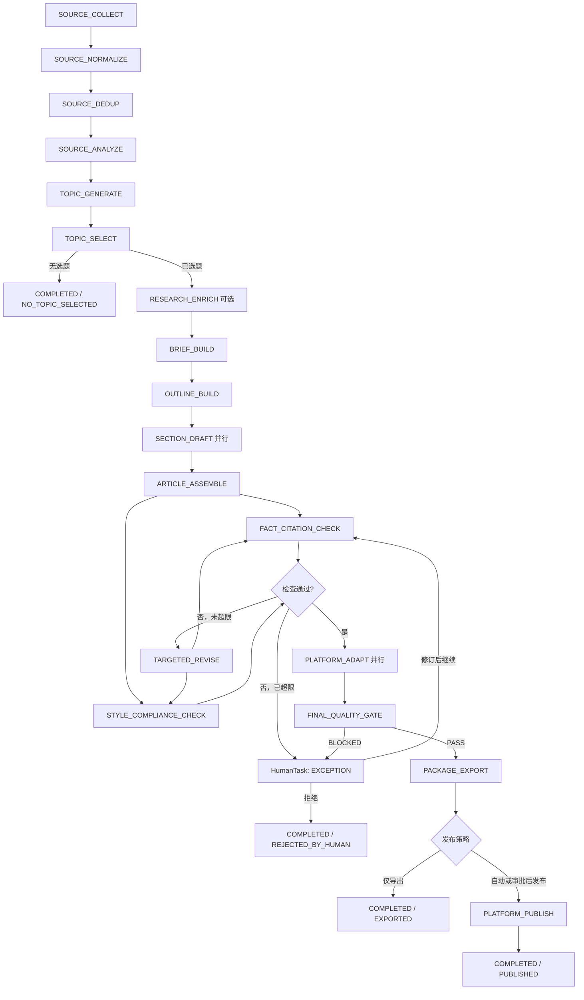
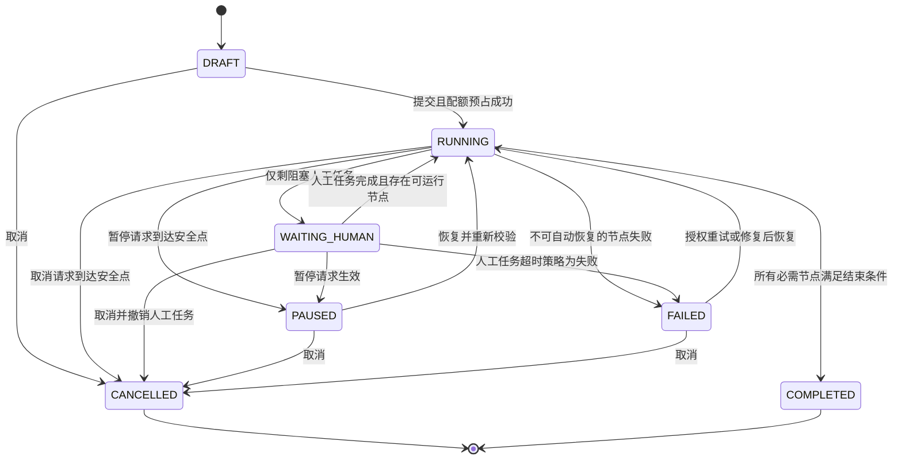
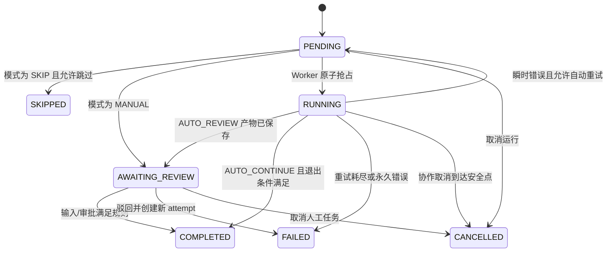
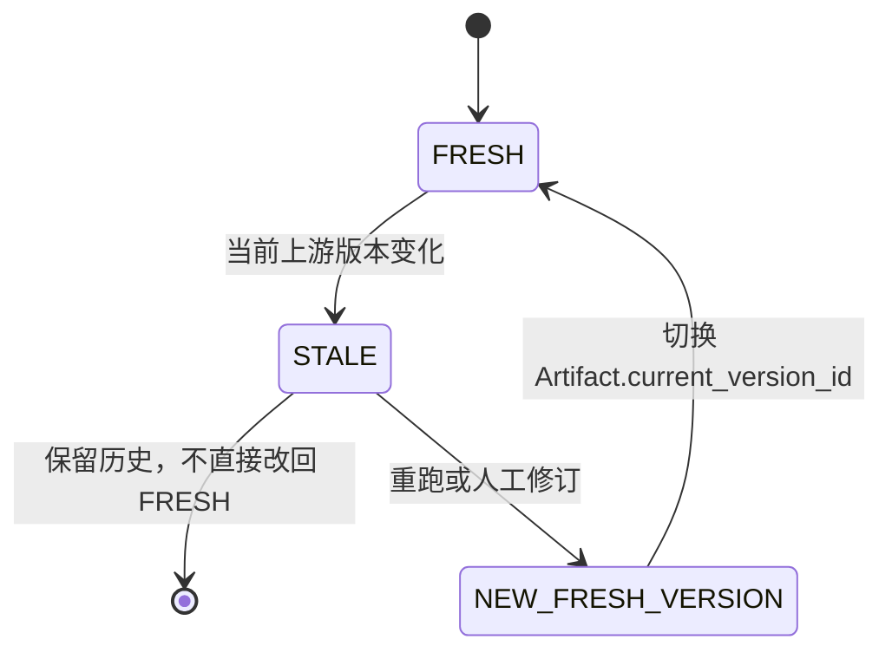

# 工作流状态机详细设计

> 文档状态：设计基线  
> 适用范围：SaaS 多租户内容生产系统首版  
> 技术边界：LangGraph + PostgreSQL Checkpoint + Celery/Redis，首版不引入 Temporal

## 1. 目标与设计原则

本文定义批量采集、分析选题、分步生成、人工审核、导出发布包及可选自动发布的状态模型。它是后续数据库、API、Worker、权限和前端任务中心设计的共同约束。

核心原则：

1. 同一套流程支持全自动、人机协同、全人工和自定义模式。
2. 每个节点都可以按策略自动执行、等待审核、人工填写或跳过。
3. 业务阶段、执行状态、审批结论分别建模，不使用一个枚举混合表达。
4. PostgreSQL 是业务状态唯一事实源；LangGraph、Celery 和 Redis 不拥有业务最终状态。
5. 任何产物修改都创建新版本，历史版本不可覆盖。
6. 审批绑定具体产物版本和依赖快照，上游变化后旧审批自动失效。
7. 外部副作用必须幂等；自动发布必须经过不可绕过的安全门禁。
8. 租户策略、工作流模板和权限在运行开始时生成快照，运行中不随配置漂移。

## 2. 核心概念与分层



### 2.1 BatchRun

`BatchRun` 表示一次批量生产任务，负责：

- 保存租户、工作空间、工作流模板和策略快照引用。
- 生成和管理多个 `ContentRun`。
- 控制批次并发、配额预占、暂停、恢复和取消。
- 聚合成功、失败、等待人工、取消和跳过数量。
- 提供批次级重试入口，但不直接执行文章节点。

批次成功不要求每个内容运行都成功。`BatchRun.status=COMPLETED` 后通过 `outcome` 区分 `ALL_SUCCEEDED`、`PARTIAL_SUCCEEDED` 和 `NO_CONTENT_CREATED`。

### 2.2 ContentRun

`ContentRun` 表示一篇候选内容从素材到交付的完整生命周期，负责：

- 固定 `tenant_id`、`workspace_id`、`brand_id`，并关联包含策略快照的 `WorkflowRun`。
- 记录当前业务阶段、执行状态、质量结论和交付结果。
- 通过 1:1 `WorkflowRun` 关联 LangGraph 执行记录。
- 在业务语义上串联和分支多个 `NodeRun`。
- 聚合阻塞它的 `HumanTask`、失败节点和过期产物。

一个 `ContentRun` 只生产一个内容母版，但可以生成多个平台变体和多个发布包。

### 2.3 WorkflowRun（内部执行记录）

`WorkflowRun` 是 `ContentRun` 的 1:1 技术执行伴随记录，保存模板版本、策略快照、LangGraph `thread_id/checkpoint_ref`、当前节点和失败信息。它不形成新的业务层级：用户和权限仍以 `ContentRun` 为单篇内容根，`NodeRun` 通过 `workflow_run_id` 归属该内容运行。

### 2.4 NodeRun

`NodeRun` 是某个节点的一次逻辑执行实例，负责：

- 记录节点类型、执行模式、输入版本集合和输出版本集合。
- 记录状态、尝试次数、超时、错误分类、Worker 任务 ID 和幂等键。
- 记录节点使用的模型、Prompt、工具和规则版本。
- 支持自动重试以及用户显式重跑。

自动重试仍使用同一个 `NodeRun` 并记录基础设施重试次数；用户显式重跑创建 `attempt_no + 1` 的新 `NodeRun`。这样可以区分基础设施重试与业务重新生成。

### 2.5 HumanTask

`HumanTask` 表示需要用户处理的可分配工作，不等同于 `NodeRun` 状态。任务类型包括：

- `INPUT`：人工创建或填写节点结果。
- `REVIEW`：审核自动生成结果。
- `REWORK`：按驳回意见修改或重新生成。
- `EXCEPTION`：处理失败、冲突、超限或 DLQ 任务。
- `PUBLISH_CONFIRMATION`：确认高风险发布。

它负责候选处理人、领取人、截止时间、委托、审批意见和处理结论。首版同一节点最多一个开放 HumanTask；双人审批由该任务关联的 `ApprovalRequest/ApprovalDecision` 收集多个决定，审批规则满足后节点才能退出。返工或升级会先关闭旧任务，再创建下一项任务。

## 3. 状态职责唯一归属

| 组件 | 负责 | 不负责 |
|---|---|---|
| PostgreSQL 业务表 | BatchRun、ContentRun、WorkflowRun、NodeRun、HumanTask、产物版本、审批、幂等记录、Outbox、DLQ 的最终状态 | 不充当消息 Broker |
| LangGraph | 单个 ContentRun 的节点拓扑、条件分支、循环修订、技术性 checkpoint 和恢复游标 | 不作为用户可见业务状态源，不独立决定权限、配额和发布 |
| Celery | 异步任务投递、Worker 执行、定时扫描和受控自动重试 | 不以 Celery result backend 作为流程状态，不决定下一业务节点 |
| Redis | Celery Broker、短期分布式锁、限流、去重窗口和缓存 | 不保存不可恢复的业务状态，不作为审批或版本事实源 |

状态写入规则：

1. 应用服务在 PostgreSQL 事务中更新业务状态，并写入 `outbox_event`。
2. Outbox Dispatcher 将事件投递给 Celery；投递至少一次，因此消费者必须幂等。
3. Worker 执行前以 `node_run_id + expected_status` 原子抢占节点。
4. Worker 完成后先提交产物和业务状态，再由 Outbox 推进后继节点。
5. LangGraph checkpoint 只保存恢复所需的节点游标及产物版本 ID，不复制正文作为另一份可编辑真相。
6. 对账任务定期检查 PostgreSQL 中长期 `PENDING/RUNNING` 的记录，而不是信任 Celery 任务结果。

## 4. 业务阶段与执行状态分离

### 4.1 业务阶段 `business_stage`

业务阶段回答“内容进行到哪里”，用于页面分组、报表和权限条件：

| 阶段 | 含义 |
|---|---|
| `COLLECTION` | 采集、清洗和去重 |
| `DISCOVERY` | 素材分析、候选选题和选题确认 |
| `PLANNING` | 补充研究、Brief 和大纲 |
| `DRAFTING` | 分段写作和内容合并 |
| `VALIDATION` | 事实、引用、风格、合规和定向修订 |
| `ADAPTATION` | 公众号、小红书等平台适配及终检 |
| `DELIVERY` | 发布包导出和可选发布 |
| `DONE` | 内容运行已经结束 |

`business_stage` 不是状态机终态。内容在 `PLANNING` 阶段既可能是 `RUNNING`，也可能是 `WAITING_HUMAN`、`PAUSED` 或 `FAILED`。

并行节点存在时，当前阶段取“尚未满足退出条件的最早阻塞阶段”。该值可以冗余存储用于查询，但必须由状态推进服务在同一事务中维护，不允许前端直接修改。

### 4.2 执行状态 `status`

#### BatchRun / ContentRun

```text
DRAFT -> RUNNING
RUNNING -> WAITING_HUMAN | PAUSED | COMPLETED | FAILED | CANCELLED
WAITING_HUMAN -> RUNNING | PAUSED | FAILED | CANCELLED
PAUSED -> RUNNING | CANCELLED
FAILED -> RUNNING | CANCELLED
```

终态为 `COMPLETED` 和 `CANCELLED`。`FAILED` 是可恢复的停止态，只有按保留策略归档后才不再恢复。暂停和取消的过渡过程分别用 `pause_requested_at`、`cancel_requested_at` 表示；在安全点到达前保持原状态，不新增 `PAUSING/CANCELLING` 枚举。

`WorkflowRun` 不维护第二套业务状态，只保存模板、策略快照和 LangGraph checkpoint 等技术执行信息。单篇业务状态以 `ContentRun.status` 为准，并行节点状态以 `NodeRun.status` 为准。

#### NodeRun

```text
PENDING -> RUNNING | AWAITING_REVIEW | SKIPPED | CANCELLED
RUNNING -> COMPLETED | AWAITING_REVIEW | PENDING | FAILED | CANCELLED
AWAITING_REVIEW -> COMPLETED | FAILED | CANCELLED
```

`PENDING` 同时覆盖已创建、待 Outbox 投递和 Celery 排队，具体投递情况由 dispatch 记录表达。`COMPLETED` 表示节点执行和所需审批均完成。自动生成后待审、以及 `MANUAL` 等待人工输入，都使用 `AWAITING_REVIEW`，再由 HumanTask 的 `task_type` 区分。

产物是否过期不写入 NodeRun 状态。已经完成的 NodeRun 保持历史执行事实，`ArtifactVersion.freshness_status` 使用 `FRESH/STALE` 表示新鲜度；重新生成时创建新的 NodeRun attempt。

#### HumanTask

```text
OPEN -> CLAIMED -> COMPLETED
OPEN -> COMPLETED | CANCELLED | EXPIRED
CLAIMED -> OPEN | COMPLETED | CANCELLED | EXPIRED
```

人工结论单独保存在 `decision`：`APPROVE`、`EDIT_AND_APPROVE`、`REJECT`、`REQUEST_REWORK`、`SKIP`。并非每一种任务都允许全部结论，允许集合由节点和审批策略确定。

### 4.3 结束结果 `outcome`

状态表示是否结束，结果表示如何结束：

- BatchRun：`ALL_SUCCEEDED`、`PARTIAL_SUCCEEDED`、`NO_CONTENT_CREATED`。
- ContentRun：`EXPORTED`、`PUBLISHED`、`NO_TOPIC_SELECTED`、`REJECTED_BY_HUMAN`、`POLICY_BLOCKED`。
- NodeRun：结果由输出产物和错误分类表达，不再扩展状态枚举。

## 5. 工作流预设与节点执行模式

### 5.1 四种预设

| 预设 | 说明 | 默认人工卡点 |
|---|---|---|
| `FULL_AUTO` | 从采集到导出自动运行；自动发布仍受安全门禁约束 | 无普通卡点，风险策略可以强制插入人工确认 |
| `ASSISTED` | AI 执行主要工作，人审核关键决策 | 选题、大纲、最终版本、发布 |
| `FULL_MANUAL` | 主要内容产物由人工填写，系统负责规则检查和流转 | 采集确认、选题、Brief、大纲、正文、平台版本、发布 |
| `CUSTOM` | 租户管理员逐节点配置 | 由模板定义 |

预设只用于生成 `workflow_policy_snapshot`。运行开始后实际行为只读取快照，不再读取可变模板。

### 5.2 节点执行模式

| 模式 | 执行行为 |
|---|---|
| `AUTO_CONTINUE` | Worker 自动执行，成功后继续 |
| `AUTO_REVIEW` | Worker 自动执行，保存结果后创建 `REVIEW` HumanTask，满足审批规则后继续 |
| `MANUAL` | 不调用自动执行器，直接创建 `INPUT` HumanTask；人工提交结构化产物后继续 |
| `SKIP` | 不执行并记录跳过原因，仅允许可选节点使用 |
| `DISABLED` | 在模板编译时排除节点，不创建 NodeRun |

`DISABLED` 只在模板层生效，运行快照中不创建对应节点。必需节点不能配置 `SKIP/DISABLED`；模板发布时必须通过拓扑、输入可达性和安全策略校验。

运行中切换模式的规则：

- 仅对尚未开始的节点生效，并生成新的运行策略修订版本。
- `RUNNING` 节点不能直接改模式，应先请求暂停并等待安全点。
- 已完成节点不因模式变化自动重跑。
- 修改发布相关模式必须重新执行权限、配额和安全策略校验。

## 6. 标准节点清单与契约

下表是首版标准工作流。租户可禁用可选节点，但不能删除系统安全门禁。

| 序号 | 节点代码 / 阶段 | 主要输入 | 结构化输出 | 进入条件 | 成功退出条件 |
|---:|---|---|---|---|---|
| 1 | `SOURCE_COLLECT` / COLLECTION | 来源策略快照、连接器、关键词、时间窗、人工 URL/文件 | `SourceSnapshot[]`、采集统计、来源错误 | 配额预占成功；来源在允许范围；连接器可用 | 至少一个有效快照，或按策略以“无素材”结束 |
| 2 | `SOURCE_NORMALIZE` / COLLECTION | 原始来源快照 | 清洗正文、元数据、语言、内容哈希、安全标记 | 快照已完成恶意文件、SSRF 和 HTML 安全检查 | 所有可处理来源已规范化；失败项已隔离并记录 |
| 3 | `SOURCE_DEDUP` / COLLECTION | 规范化来源、历史素材指纹 | `SourceSetVersion`、重复组和保留理由 | 规范化完成 | 去重集合非空，或按策略结束为无可用素材 |
| 4 | `SOURCE_ANALYZE` / DISCOVERY | 去重素材、品牌、受众、分析 Prompt | 主题聚类、事实摘要、关键词、风险和可信度 | 素材集合版本有效且非 `STALE` | 输出通过 Schema 校验；每项结论可追溯到来源 |
| 5 | `TOPIC_GENERATE` / DISCOVERY | 分析结果、历史选题、内容目标 | `TopicCandidate[]` 及价值、重复、风险评分 | 分析完成 | 候选集合通过去重及最低质量规则 |
| 6 | `TOPIC_SELECT` / DISCOVERY | 候选选题、租户策略、人工偏好 | `SelectedTopicVersion` 或“不选题”结论 | 有合格候选，或允许人工新增选题 | 仅一个主选题被确认；无选题时 ContentRun 正常结束 |
| 7 | `RESEARCH_ENRICH` / PLANNING，可选 | 已选选题、已有素材、补采策略 | 补充来源、证据卡、待核事实 | 选题已确认；补采域名和预算可用 | 必需事实具备来源，未解决项明确标记 |
| 8 | `BRIEF_BUILD` / PLANNING | 选题、证据、品牌规则、平台目标 | `ContentBriefVersion` | 选题有效；上游版本非 `STALE` | 受众、目标、核心观点、边界、篇幅和 CTA 完整 |
| 9 | `OUTLINE_BUILD` / PLANNING | Brief、证据卡、历史模板 | `OutlineVersion`、章节与引用规划 | Brief 有效 | 章节顺序和目标完整；引用规划可达；Schema 校验成功 |
| 10 | `SECTION_DRAFT` / DRAFTING | 大纲章节、Brief、分配来源、已锁定内容 | `SectionVersion[]` | 大纲有效；每个章节输入准备完成 | 所有必需章节成功；人工锁定块未被覆盖；允许并行 fan-out/fan-in |
| 11 | `ARTICLE_ASSEMBLE` / DRAFTING | 章节版本、标题候选、Brief | `ArticleMasterVersion` | 所有必需章节成功或经批准跳过 | 结构完整、语气统一、引用 ID 可解析、内容块 Schema 有效 |
| 12 | `FACT_CITATION_CHECK` / VALIDATION | 内容母版、来源快照、证据卡 | 事实问题、引用覆盖率、证据冲突、建议修订 | 内容母版有效 | 检查完整；严重事实问题为零，或被授权人工明确处置 |
| 13 | `STYLE_COMPLIANCE_CHECK` / VALIDATION | 内容母版、品牌规则、平台合规规则 | 风格分、重复度、敏感项、合规结论 | 内容母版有效；规则版本已固定 | 阻断级问题为零；非阻断项已记录 |
| 14 | `TARGETED_REVISE` / VALIDATION，可循环 | 问题清单、受影响章节、锁定块、来源 | 新章节/母版版本、问题处置记录 | 检查未通过且未超过最大修订次数 | 问题已修复后返回检查节点；超限则转人工异常任务 |
| 15 | `PLATFORM_ADAPT` / ADAPTATION | 已通过检查的母版、平台模板、账号能力 | `PlatformVariantVersion[]` | 母版通过质量门禁；目标平台已配置 | 各平台标题、正文、标签、图片槽位和格式均通过 Schema 校验 |
| 16 | `FINAL_QUALITY_GATE` / ADAPTATION | 平台版本、全部检查结果、审批和策略快照 | `QualityGateDecision`、风险明细 | 目标平台变体完成 | 每个平台明确为 `PASS`、`REVIEW_REQUIRED` 或 `BLOCKED` |
| 17 | `PACKAGE_EXPORT` / DELIVERY | 通过门禁的平台版本、素材、导出模板 | HTML/Markdown/JSON/ZIP 等 `PublishPackageVersion` | 平台版本非 `STALE`；导出权限和配额有效 | 文件哈希、清单和预览生成成功；对象存储写入幂等 |
| 18 | `PLATFORM_PUBLISH` / DELIVERY，可选 | 已批准发布包、平台账号、发布时间 | `PublicationReceipt`、平台内容 ID、状态 | 通过第 12 节全部安全门禁 | 平台接受请求且回执持久化；未知结果必须进入对账，不能盲目重发 |

节点共通进入条件：租户有效、运行未暂停/取消、调用者或服务身份有权限、配额未硬性超限、依赖产物版本存在且非 `STALE`、幂等抢占成功。

节点共通退出条件：输出通过 Pydantic Schema 校验并提交为新产物版本；依赖边已记录；模型调用、费用和审计记录已写入；需要人工审核时审批规则已经满足。

## 7. 主流程与状态图

### 7.1 内容生产主流程



任意配置为 `AUTO_REVIEW` 或 `MANUAL` 的节点都会在自身边界插入 `HumanTask`，但不改变上图的业务拓扑。

### 7.2 ContentRun 执行状态



### 7.3 NodeRun 与人工任务



NodeRun 的 `COMPLETED/FAILED/CANCELLED` 是历史执行事实，不因上游修改而改写。上游变化作用于产物版本：



## 8. 状态转换表

### 8.1 聚合运行转换

| 对象 | 当前状态 | 事件/守卫 | 目标状态 | 原子副作用 |
|---|---|---|---|---|
| BatchRun | `DRAFT` | `START`；租户有效、配额可预占 | `RUNNING` | 固定策略快照，创建 ContentRun，写 Outbox |
| BatchRun | `RUNNING` | 所有非终态 ContentRun 都仅等待人工 | `WAITING_HUMAN` | 更新聚合计数 |
| BatchRun | `WAITING_HUMAN` | 任一 ContentRun 恢复执行 | `RUNNING` | 写恢复事件 |
| BatchRun | `RUNNING/WAITING_HUMAN` | `PAUSE_REQUESTED` 后所有子运行到达安全点 | `PAUSED` | 请求期间阻止新节点并记录 `pause_requested_at` |
| BatchRun | `PAUSED` | `RESUME` 且权限/配额有效 | `RUNNING` | 清除暂停请求，重新投递可运行子任务 |
| BatchRun | 任一非终态 | `CANCEL_REQUESTED` 且子运行已停止/对账 | `CANCELLED` | 请求期间停止新任务、撤销人工任务，完成后释放配额 |
| BatchRun | `RUNNING/WAITING_HUMAN` | 所有 ContentRun 终止 | `COMPLETED` | 计算 outcome 和统计 |
| ContentRun | `DRAFT` | `START` 且有可运行 NodeRun | `RUNNING` | 创建 WorkflowRun/NodeRun，写 Outbox |
| ContentRun | `RUNNING` | 无可运行节点且存在阻塞 HumanTask | `WAITING_HUMAN` | 记录阻塞任务集合 |
| ContentRun | `WAITING_HUMAN` | 阻塞任务满足且后继可运行 | `RUNNING` | 推进 Graph，写 Outbox |
| ContentRun | `RUNNING` | 节点永久失败或 DLQ | `FAILED` | 生成异常任务和错误摘要 |
| ContentRun | `FAILED` | `RETRY/RESOLVE`；输入和权限有效 | `RUNNING` | 新建显式重跑 NodeRun attempt |
| ContentRun | `RUNNING` | 全部必需节点成功或批准跳过 | `COMPLETED` | 写 outcome，结算配额和成本 |

聚合规则：只要还有可运行节点，ContentRun 保持 `RUNNING`；只有没有可运行节点且存在阻塞人工任务时才是 `WAITING_HUMAN`。BatchRun 同理，避免一个子任务待审导致整个批次停止并发处理。

### 8.2 节点与人工转换

| 当前状态 | 事件/守卫 | 目标状态 | 处理 |
|---|---|---|---|
| `PENDING` | `DISPATCH/CLAIM`；依赖有效、模式自动且版本匹配 | `RUNNING` | Outbox 投递后由 Worker 条件更新抢占 |
| `PENDING` | `CREATE_MANUAL_TASK`；模式 MANUAL | `AWAITING_REVIEW` | 创建 `INPUT` HumanTask |
| `PENDING` | `SKIP`；节点可选且操作者有权限 | `SKIPPED` | 保存原因和审计，不创建伪产物 |
| `RUNNING` | `OUTPUT_COMMITTED`；AUTO_CONTINUE | `COMPLETED` | 原子保存产物、依赖、成本、Outbox |
| `RUNNING` | `OUTPUT_COMMITTED`；AUTO_REVIEW | `AWAITING_REVIEW` | 保存产物并创建 `REVIEW` HumanTask |
| `RUNNING` | `TRANSIENT_ERROR` 且未耗尽 | `PENDING` | 递增基础设施重试计数，设置 `next_retry_at` |
| `RUNNING` | 永久错误或重试耗尽 | `FAILED` | 写错误分类；必要时进入 DLQ |
| `AWAITING_REVIEW` | `APPROVE`；审批数量及职责分离满足 | `COMPLETED` | 锁定批准版本，推进后继节点 |
| `AWAITING_REVIEW` | `EDIT_AND_APPROVE` | `COMPLETED` | 新建人工版本，对新版本写 `APPROVE`，旧版本被替代 |
| `AWAITING_REVIEW` | `REQUEST_REWORK` | `FAILED` | 当前 attempt 以返工结束，新建 `PENDING` attempt；ContentRun 保持 `RUNNING` |
| `AWAITING_REVIEW` | `REJECT_CONTENT` | `COMPLETED` | 关闭当前内容生产，ContentRun 进入 `COMPLETED/REJECTED_BY_HUMAN` |
| ArtifactVersion `FRESH` | `UPSTREAM_VERSION_CHANGED` | `STALE` | NodeRun 历史状态不变；失效旧审批并传播到下游产物 |
| ArtifactVersion `STALE` | `RERUN/EDIT` | 新版本 `FRESH` | 创建新 NodeRun 或人工版本，旧版本继续保持 `STALE` |

所有转换 API 必须携带 `expected_version`。数据库使用 `UPDATE ... WHERE id=? AND version=? AND status IN (...)`，影响行数为零时返回冲突，禁止最后写入者静默覆盖前一处理结果。

## 9. 暂停、恢复、取消、重跑与回退

### 9.1 暂停

- 暂停是协作式操作，不依赖强制终止 Celery 进程。
- 收到请求后写入 `pause_requested_at`，运行在到达安全点前保持原状态，同时不再派发新节点。
- 正在调用外部模型或平台的节点在可确认安全点提交结果后暂停；无法中断的调用允许结束，但不推进后继节点。
- 开放 HumanTask 保留但禁止提交，或者按租户策略允许继续编辑但不推进。
- 所有在途节点结束或记录为可恢复后，运行进入 `PAUSED`。

### 9.2 恢复

- 恢复前重新检查租户状态、操作者权限、密钥可用性和硬配额。
- 从 PostgreSQL 读取业务状态，并用 `WorkflowRun.checkpoint_ref` 对应的 LangGraph checkpoint 恢复拓扑游标。
- 对已提交产物的节点不得重复执行；发现 checkpoint 与业务状态冲突时以 PostgreSQL 为准并执行对账修复。

### 9.3 取消

- 取消后禁止产生新的节点、人工任务和发布请求。
- NodeRun 的 `PENDING/AWAITING_REVIEW` 可直接取消；`RUNNING` 节点使用取消标记在安全点退出。
- 已发生的外部发布通常不可事务回滚。系统记录 `PublicationReceipt`，按平台能力创建撤回/删除补偿任务；不能把补偿失败伪装成已取消成功。
- `CANCELLED` 只表示系统不再推进，不删除产物和审计记录。

### 9.4 重跑

- 自动重试处理同一输入上的瞬时失败，沿用 `NodeRun`。
- 用户重跑表示业务上重新生成，创建新 `NodeRun` 和新产物版本。
- 重跑支持当前节点、指定章节、失败节点和从某节点向后重跑。
- 重跑前检查人工锁定块；默认保留锁定内容，除非具备解锁权限并明确确认。
- 新产物提交后触发下游依赖失效，不删除旧分支。

### 9.5 回退

“回退到某版本”不是数据库回滚，而是从历史版本创建新的当前版本：

1. 选择历史 `ArtifactVersion` 作为基线。
2. 创建新的版本记录，写入 `restored_from_version_id`。
3. 更新当前版本指针并递增乐观锁版本。
4. 使依赖旧当前版本的下游产物和审批失效。
5. 用户选择重跑下游、创建内容分支或保留为草稿。

已发布内容回退不会自动修改平台内容，必须另行执行更新、撤回或重新发布操作。

## 10. 人工编辑、版本与 STALE 传播

### 10.1 不可变版本

每次 AI 输出、人工编辑、导入、回退或平台适配都创建新的 `ArtifactVersion`。最低字段：

```text
id, tenant_id, artifact_id, version_no, artifact_type
content_json, content_hash, schema_version
created_by_type, created_by_id, created_at
based_on_version_ids, prompt_version_id, model_call_id
locked_paths, change_reason, restored_from_version_id
```

`ArtifactDependency` 记录字段级或章节级依赖：

```text
upstream_version_id
downstream_version_id
dependency_scope       # WHOLE_ARTIFACT / SECTION / CITATION / PLATFORM_FIELD
upstream_path
downstream_path
```

### 10.2 STALE 传播算法

人工或 AI 创建新上游版本并设为当前版本后：

1. 在同一事务中写入 `ARTIFACT_VERSION_ACTIVATED` Outbox 事件。
2. 依赖服务从旧当前版本沿 `ArtifactDependency` 广度遍历下游。
3. 直接依赖旧版本且未重新验证的活动下游 `ArtifactVersion.freshness_status` 从 `FRESH` 变为 `STALE`；其来源 NodeRun 历史状态保持不变。
4. 仅依赖某章节时，只标记对应章节检查、平台变体和发布包，避免全文重跑。
5. 继续传播至其下游；传播操作以 `event_id + downstream_id` 幂等。
6. 已完成的 ContentRun 不重新打开；需要继续修改时创建关联原运行的修订 ContentRun，保留原终态和发布审计链。

典型传播范围：

| 修改对象 | 默认失效范围 |
|---|---|
| 来源正文或可信度 | 分析、选题、Brief、大纲、引用它的章节、检查、平台版本、发布包 |
| 已选选题 | Brief、大纲、全部章节、检查、平台版本、发布包 |
| Brief | 大纲、受影响章节及全部下游检查和交付物 |
| 大纲单章节 | 对应章节、母版、相关检查、平台版本、发布包 |
| 正文单章节 | 母版、该章节事实检查、全篇风格检查、平台版本、发布包 |
| 平台版本 | 最终门禁、对应平台发布包和发布审批 |

`STALE` 不等于自动删除或立刻重跑：

- `FULL_AUTO` 默认自动重跑最小受影响子图。
- `ASSISTED/CUSTOM` 按策略询问用户重跑、创建分支或放弃变更。
- 全自动发布绝不允许使用 `STALE` 产物。
- “沿用旧结果”只能作为草稿决策；若下游安全门禁依赖已变化，必须重新验证。

### 10.3 审批失效

审批记录必须绑定：

```text
artifact_version_id
artifact_content_hash
dependency_snapshot_hash
policy_snapshot_id
approval_rule_version
```

任一绑定值变化，审批立即标记 `SUPERSEDED`，尚未完成的 HumanTask 标记 `CANCELLED` 并重新生成。审批通过后的排版无语义变化可以通过字段级策略免于全文审批，但最终发布包哈希仍需重新确认。

## 11. 并发编辑、锁与职责分离

### 11.1 乐观锁是正确性边界

- `Artifact`、`NodeRun`、`HumanTask` 均有递增 `version` 字段。
- 提交编辑必须携带 `base_version_id` 和记录 `expected_version`。
- 版本不匹配返回 `409 Conflict`，前端展示差异并由用户合并。
- 不允许静默覆盖或仅依赖前端禁用按钮。

### 11.2 租约和短期锁

- HumanTask 可领取并设置 `lease_owner`、`lease_expires_at`，到期可重新领取。
- Redis 锁只减少并发碰撞，不能替代数据库唯一约束和乐观锁。
- Worker 抢占通过 PostgreSQL 条件更新；租约超时后由对账任务确认外部副作用，再决定重投。
- 同一 `content_run_id + node_key` 只允许一个活动 NodeRun；`attempt_no` 区分业务重跑，数据库部分唯一索引兜底。

### 11.3 审批职责分离

- 可配置“提交人不能审批自己的版本”。
- 最终发布者与最终内容审批者可要求不同人员。
- 高风险内容支持双人顺序或并行审批。
- 委托必须有起止时间、范围和审计记录，不能扩大原授权人的权限。
- 服务账号只能执行自动节点，不能伪造人工审批身份。

## 12. 重试、超时、幂等与 DLQ

### 12.1 错误分类

| 分类 | 示例 | 默认处理 |
|---|---|---|
| `TRANSIENT` | 网络抖动、429、供应商 5xx | 指数退避加随机抖动，节点内自动重试 |
| `PERMANENT_INPUT` | Schema 无法修复、来源格式不支持 | 失败并创建人工异常任务 |
| `POLICY_BLOCKED` | 配额、合规、权限或域名策略阻断 | 不自动重试，等待策略或人工处理 |
| `EXTERNAL_UNKNOWN` | 发布超时但不知道平台是否受理 | 先按幂等键查询/对账，禁止盲目重发 |
| `SYSTEM_BUG` | 不变量破坏、未知异常 | 快速失败、告警、进入 DLQ |

### 12.2 超时

- 每个节点配置排队超时、执行软超时和硬超时。
- LLM、采集和平台调用还要有独立连接/读取超时。
- 软超时触发协作取消和状态保存；硬超时由 Worker 回收，但后续必须对账。
- HumanTask 使用业务截止时间；超时策略可为提醒、升级、转派、降级为人工异常或使运行失败，不默认自动批准。

### 12.3 幂等

建议键格式：

```text
node:{tenant_id}:{content_run_id}:{node_key}:{input_snapshot_hash}:{attempt_no}
export:{tenant_id}:{platform_variant_version_id}:{template_version}
publish:{tenant_id}:{platform_account_id}:{publish_package_hash}
```

- 幂等记录存 PostgreSQL，包含请求哈希、状态和已提交结果引用。
- 相同键不同请求哈希视为冲突。
- 对象存储文件名使用内容哈希，避免重复上传。
- 发布调用优先使用平台幂等能力；平台不支持时以本地请求记录、发布前查询和回执对账降低重复风险。

### 12.4 DLQ

重试耗尽、反序列化失败、系统不变量破坏或长期无法对账的任务进入持久化 `dead_letter_job`。每条记录包含租户、运行、节点、原事件、错误、尝试历史、载荷引用和敏感信息脱敏摘要。

DLQ 支持：查看、指派、修复后重放、标记忽略和关联事故。重放必须生成新的 dispatch ID，但沿用原业务幂等键，防止重复副作用。Celery Broker 自身的失败队列不能替代该业务 DLQ。

## 13. 全自动发布安全门禁

`FULL_AUTO` 只代表普通节点无需人工等待，不代表绕过系统发布规则。`PLATFORM_PUBLISH` 开始前必须在同一份只读门禁结果中满足：

1. 系统、套餐、租户、工作空间、品牌和平台账号均允许自动发布。
2. 工作流使用的策略快照有效，且没有系统级紧急停止开关。
3. 服务身份拥有目标平台账号的发布权限，租户和数据范围匹配。
4. 发布包、平台版本、母版及所有必需依赖均为当前版本且非 `STALE`。
5. 事实、引用、合规、品牌和平台格式门禁均 `PASS`，阻断问题为零。
6. 风险等级未触发强制人工审批；触发时自动降级为 `PUBLISH_CONFIRMATION`。
7. 自动生成内容、广告、医疗、金融等声明满足平台及租户规则。
8. 日发布量、Token、费用和平台限流额度已原子预占。
9. 平台凭证有效，目标账号、发布时间和内容可见范围明确。
10. 发布幂等键未成功使用；未知历史请求已完成平台侧对账。
11. 最终包哈希与最后一次批准或门禁检查的哈希完全一致。
12. 审计、模型调用和来源追溯信息完整，可定位到具体版本。

任一门禁失败时：

- 可修复问题创建 `EXCEPTION` 或 `PUBLISH_CONFIRMATION` HumanTask。
- 不可修复的政策禁止项将 ContentRun 置为 `COMPLETED` 且 `outcome=POLICY_BLOCKED`；可修复配置问题创建 `EXCEPTION` HumanTask 并保持 `WAITING_HUMAN`。`FAILED` 只用于执行失败，不用于表达政策结论。
- 不允许通过前端参数跳过系统硬门禁。
- 连续发布失败触发租户/账号级熔断，后续发布转人工处理。

## 14. 异常场景与预期处理

| 场景 | 预期行为 |
|---|---|
| Worker 在模型调用后、提交结果前崩溃 | 同一 NodeRun 重新领取；用幂等键查询调用记录，无法复用时按策略重调；只提交一个当前产物版本 |
| 数据库已提交成功但 Celery 消息未发送 | Outbox Dispatcher 重投，消费者幂等处理 |
| Celery 重复投递同一节点 | 条件更新抢占失败的 Worker 直接确认消息，不重复执行 |
| LangGraph checkpoint 落后于业务表 | 对账器以 PostgreSQL 产物和 NodeRun 为准修复 checkpoint，不回滚业务状态 |
| 用户编辑时 AI 节点同时完成 | 依据乐观锁只允许一个当前版本提交；另一方保留候选版本并提示合并，不能覆盖 |
| 审批期间上游内容变化 | 旧审批和任务失效，产物版本转 `STALE`，基于新依赖生成新 NodeRun 和任务 |
| 人工任务处理人离职或超时 | 租约释放，按规则转派/升级；永不默认批准 |
| 模型返回非法结构 | 先执行有上限的结构修复；仍失败则归类 `PERMANENT_INPUT` 或切换允许的备用模型并重新过门禁 |
| 模型供应商降级切换 | 记录新模型和成本；输出必须重新通过全部质量门禁，不能沿用旧模型审批 |
| 来源被删除或版权撤回 | 来源版本标记不可用，沿依赖传播 `STALE`；阻止新导出/发布并创建已发布内容处置任务 |
| 批次部分内容失败 | 其他 ContentRun 继续；批次最终 `COMPLETED/PARTIAL_SUCCEEDED`，失败项可独立重跑 |
| 批次暂停时仍有节点完成 | 允许提交已产生结果，但不调度后继；全部到安全点后进入 `PAUSED` |
| 取消时发布请求结果未知 | 保持对账中，不重复发布；查明平台状态后记录回执并决定补偿 |
| 平台发布成功但本地回执提交失败 | 通过发布幂等键和平台内容查询恢复回执，禁止再次创建内容 |
| 配额在运行中耗尽 | 当前原子预占内节点可结束；后继节点进入 `POLICY_BLOCKED` 并等待增额或次日恢复 |
| 租户被停用 | 停止派发新节点，运行转暂停或取消；不删除数据，平台发布立即禁止 |
| Redis 故障 | 暂停 Celery 新投递和限流相关操作；已提交业务状态不丢失，恢复后由 Outbox 和对账器续跑 |
| PostgreSQL 暂时不可用 | Worker 不执行不可确认幂等性的外部副作用；任务重试，业务状态保持原值 |
| 修订循环超过上限 | 停止自动循环，创建 HumanTask，防止无限 Token 消耗 |
| 发布包生成后模板被修改 | 运行仍使用策略快照；主动升级模板时创建新发布包版本并重新执行终检 |

## 15. 实现约束与建议字段

### 15.1 关键快照

运行创建时至少固定：

- 工作流模板版本和节点模式。
- 租户配额、采集、模型路由、质量、审批和发布策略。
- 品牌规则、Prompt 版本、输出 Schema 版本。
- 目标平台账号能力，但凭证有效性在实际调用前重新检查。

### 15.2 最小状态字段

```text
batch_run:
  id, tenant_id, workspace_id, status, outcome,
  pause_requested_at, cancel_requested_at, version, created_at, finished_at

content_run:
  id, tenant_id, workspace_id, batch_run_id, business_stage, status, outcome,
  version, started_at, finished_at

workflow_run:
  id, tenant_id, content_run_id, template_version_id, policy_snapshot_id,
  graph_thread_id, checkpoint_ref, cursor_summary, version, created_at, updated_at

node_run:
  id, tenant_id, workflow_run_id, node_key, attempt_no, execution_mode_snapshot,
  status, input_fingerprint, idempotency_key, infrastructure_retry_count,
  timeout_at, worker_task_id, error_class, output_artifact_version_id, version

human_task:
  id, tenant_id, content_run_id, node_run_id, task_type, status, decision,
  candidate_scope, assignee_id, lease_expires_at, due_at,
  artifact_version_id, expected_content_hash, version
```

所有唯一约束和外键必须包含或校验 `tenant_id`，防止跨租户引用。API 不接受客户端指定可信 `tenant_id`，而从认证上下文注入。

### 15.3 状态推进服务

后端应提供唯一的 `WorkflowStateService` 负责：

- 校验允许的状态转换和操作者权限。
- 原子提交产物、状态、审批和 Outbox。
- 计算可运行节点、业务阶段和聚合状态。
- 传播 `STALE`，失效审批并创建人工任务。
- 驱动 LangGraph checkpoint 对账。

Controller、Celery Task 和 LangGraph Node 都不能直接随意更新状态字段，只能调用该服务提供的命令接口。

## 16. 验收标准

实现需至少通过以下状态机测试：

1. 四种预设均能从素材运行到导出；`FULL_AUTO` 不产生普通人工卡点。
2. 任一节点切换为 `AUTO_REVIEW` 或 `MANUAL` 后能暂停、编辑并恢复。
3. 批次中一个内容待审或失败不会阻塞其他内容。
4. 修改来源、选题、大纲和单章节时，`STALE` 精确传播到最小下游范围。
5. 两个用户并发编辑或审批时只有一个提交成功，另一方得到冲突信息。
6. 审批后内容变化会使审批失效；旧批准版本不能发布。
7. Worker 崩溃、消息重复和 Outbox 重投不会生成重复产物或重复发布。
8. 暂停不丢结果，恢复不重复已成功节点，取消不再创建后继节点。
9. 自动重试与用户重跑在审计和版本关系上可区分。
10. 发布结果未知时先对账，任何路径都不能盲目重复发布。
11. 全自动发布缺少任一安全门禁时被阻断并产生可处理原因。
12. PostgreSQL、LangGraph checkpoint、Celery 和 Redis 故障恢复后，业务状态仍可由 PostgreSQL 唯一重建。
