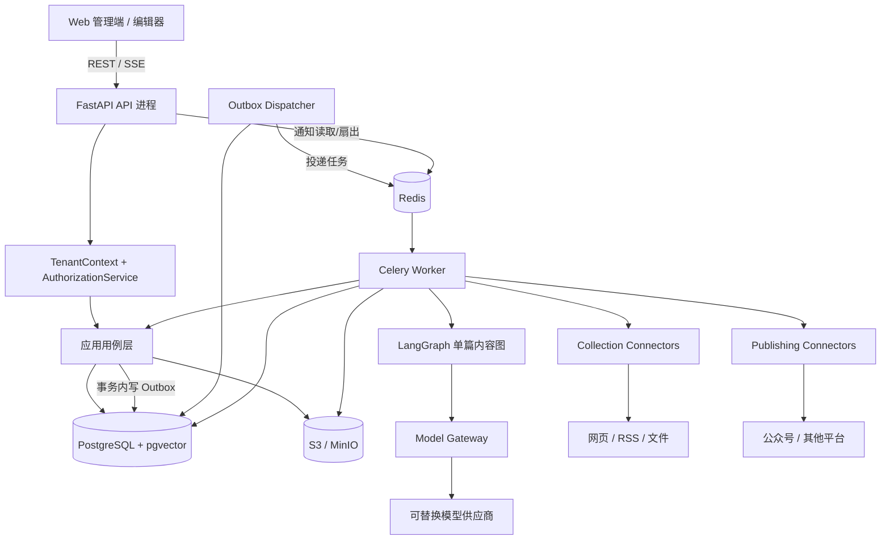
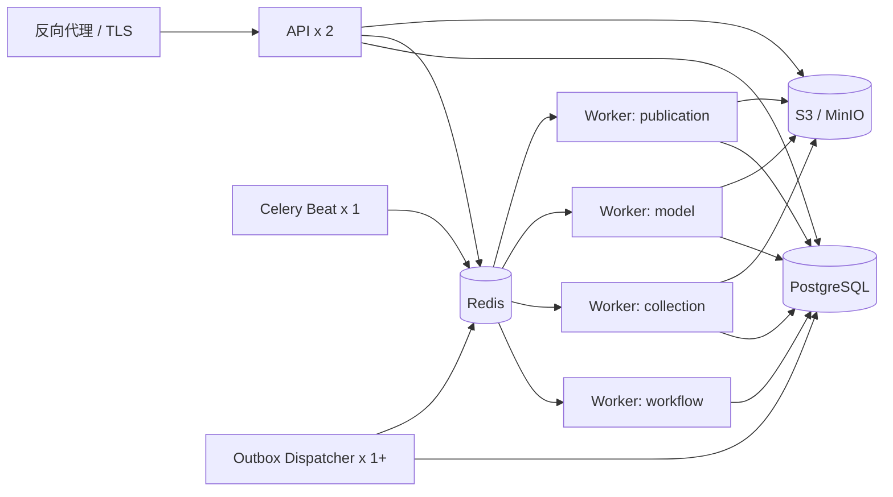
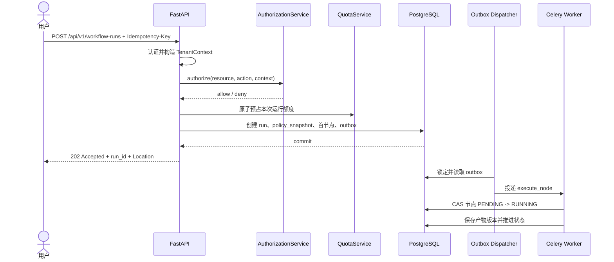

# 后端架构与 API 设计

> 状态：首版详细设计基线  
> 适用范围：小团队 SaaS 多租户内容生产平台  
> 技术基线：Python 3.12、FastAPI、SQLAlchemy 2、Alembic、PostgreSQL/pgvector、LangGraph、Celery/Redis、S3/MinIO

## 1. 目标与架构决策

首版采用“模块化单体 + 独立 Worker”。API、后台任务和定时调度共享同一套领域代码与数据库，但以不同进程运行。业务产物、工作流状态、审批和审计以 PostgreSQL 为唯一事实源。

核心决策如下：

- FastAPI 负责同步 API、认证上下文、授权、命令受理和 SSE 连接。
- Celery 负责异步任务投递、并发控制、短任务重试和周期调度，不作为业务状态源。
- LangGraph 只负责单篇内容内部的 AI 节点编排与节点检查点，不负责租户、批次、审批、发布等业务生命周期。
- PostgreSQL 保存业务状态、不可变产物版本、人工任务、配额账本、Outbox 和审计记录。
- Redis 只用于 Celery Broker、短期缓存、限流、锁和 SSE 通知扇出；Redis 数据丢失不能破坏业务正确性。
- S3/MinIO 保存原始采集快照、上传文件、图片和发布包；数据库仅保存对象引用和元数据。
- 外部模型、采集源和发布平台均通过内部协议适配，不允许领域层直接依赖供应商 SDK。

## 2. 总体架构



### 2.1 状态所有权

| 状态 | 唯一所有者 | 说明 |
|---|---|---|
| 文章、产物、版本、审批 | PostgreSQL 业务表 | 不从 LangGraph checkpoint 反推 |
| 内容运行与节点状态 | PostgreSQL `content_run/node_run` | API 展示和业务判断依据；`workflow_run` 仅保存技术执行记录 |
| AI 图内部中间态 | LangGraph checkpoint（PostgreSQL） | 只服务节点恢复，可重建 |
| 任务投递 | Outbox + Celery | Celery result backend 不作为业务依据 |
| 配额 | PostgreSQL 配额账本 | Redis 可做快速限流，但不能替代账本 |
| 通知 | PostgreSQL 通知表 | Redis 仅用于实时扇出 |

同一个失败只能由一层负责重试：网络级短暂错误可在 Node Handler/Connector 内有限重试；节点级重试由 Celery 任务策略负责；业务级“重新生成”创建新的 `node_run` attempt。LangGraph 节点不得再叠加无界自动重试。

## 3. 模块边界与依赖规则

### 3.1 业务模块

| 模块 | 职责 | 不负责 |
|---|---|---|
| `identity` | 用户、登录身份、会话、服务身份 | 业务数据授权 |
| `tenancy` | 租户、套餐、订阅状态、租户生命周期 | 内容生产 |
| `organization` | 部门、团队、成员关系 | 登录认证 |
| `authorization` | RBAC、数据范围、工作流状态策略、资源授权 | 页面按钮控制 |
| `brand` | 工作空间、品牌、风格、禁用表达 | Prompt 执行 |
| `configuration` | 配置继承、策略版本、`policy_snapshot` | 密钥明文存储 |
| `quota` | 额度定义、预占、结算、释放、使用账本 | 模型计费价格维护 |
| `source` | 来源策略、来源连接器配置、采集批次 | 文章写作 |
| `material` | 原始快照、清洗结果、去重、引用、向量索引 | 外部抓取实现 |
| `workflow` | 模板、运行、节点、状态转换、人工暂停 | 供应商 SDK 调用 |
| `content` | Topic、Brief、Outline、Article、PlatformVariant 及版本依赖 | 任务调度 |
| `review` | 人工任务、领取、编辑、批准、驳回、委托 | 通用用户权限 |
| `model` | 模型目录、租户凭证引用、路由策略、调用账本 | 供应商特有业务语义 |
| `publication` | 发布策略、平台账号、发布包、发布记录 | 内容母版生成 |
| `notification` | 站内通知、SSE 事件、已读状态 | 业务状态事实源 |
| `audit` | 不可覆盖操作审计、查询与导出 | 应用调试日志 |
| `platform_admin` | 全局供应商、套餐、系统限制、租户治理 | 租户日常运营 |

### 3.2 分层

每个模块内部按以下四层组织：

```text
api             FastAPI router、请求/响应 DTO
application     用例、命令、查询、事务编排
domain          实体、值对象、策略、领域事件、Repository 接口
infrastructure  SQLAlchemy Repository、外部 SDK Adapter、缓存实现
```

### 3.3 依赖约束

1. `domain` 不依赖 FastAPI、SQLAlchemy、Celery、LangGraph 或供应商 SDK。
2. `application` 只能依赖本模块领域层和其他模块公开的 Facade/Query Port，不能读取其他模块的数据表模型。
3. `api` 只调用应用用例，不直接调用 Repository 或提交数据库事务。
4. `infrastructure` 实现领域层定义的 Port；供应商 SDK 只能出现在该层。
5. 跨模块写操作通过应用服务或领域事件完成；禁止跨模块直接更新表。
6. 同一数据库事务内的可靠异步操作必须写 Outbox，禁止“先提交数据库，再直接调用 `delay()`”。
7. `workflow` 通过注册的 Node Handler 调用 `source/content/review/publication` 用例，不拥有这些模块的业务产物。
8. 平台管理员 API 与租户 API 使用独立路由和权限命名空间。
9. 首版可共享一个数据库和代码仓，但模块必须拥有自己的表、迁移和公开接口，为后续拆分保留边界。

## 4. 进程与部署拓扑



小团队起步可在一台主机用 Docker Compose 部署，但进程职责保持分离：

- `api`：至少 2 个进程，滚动升级时维持可用。
- `worker-workflow`：运行工作流推进和轻量节点。
- `worker-collection`：网络采集、正文提取、文件解析，设置严格出口策略。
- `worker-model`：模型调用，按供应商和租户限流。
- `worker-publication`：导出与平台发布，使用独立低并发队列。
- `celery-beat`：单实例或带分布式锁的调度器。
- `outbox-dispatcher`：可多实例，通过 `FOR UPDATE SKIP LOCKED` 竞争事件。

队列至少划分为 `workflow`、`collection`、`model`、`publication`、`maintenance`。不同队列设置独立并发数、超时、重试和死信策略，避免大批采集阻塞审批恢复或发布。

## 5. 请求与异步任务链路

### 5.1 同步命令受理



同步 API 只做参数验证、授权、配额预占和持久化，目标响应时间小于 500 ms。采集、Embedding、模型生成、导出和发布全部异步执行。

### 5.2 单篇工作流推进

1. Worker 使用 `tenant_id + run_id + node_run_id + attempt` 构造任务上下文。
2. 通过条件更新领取节点，确保同一 attempt 只有一个 Worker 执行。
3. Node Handler 读取 `policy_snapshot`、上游明确版本和节点输入。
4. AI 节点进入 LangGraph；普通确定性节点直接调用应用服务。
5. 产物以不可变 `artifact_version` 写入，并记录依赖版本。
6. 若节点模式为 `AUTO_CONTINUE`，事务内创建下一节点和 Outbox。
7. `MANUAL` 节点在投递 Worker 前直接创建输入型 `human_task`；`AUTO_REVIEW` 在产物提交后创建审核型 `human_task`。没有其他可运行节点时，`content_run` 进入 `WAITING_HUMAN`。
8. 人工批准后，新命令写入审批记录、选定版本和恢复 Outbox。
9. 最终节点完成后结算配额，工作流进入 `COMPLETED`。

### 5.3 批次

`batch_run` 只聚合多个独立 `content_run`，每个 `content_run` 再关联一个内部 `workflow_run`。每篇文章单独失败、重试、暂停和审批。批次状态由子内容运行汇总，不用一个超大 LangGraph 承载整批文章。

## 6. Tenant Context 与数据隔离

### 6.1 TenantContext

认证中间件从可信 Access Token 构造不可变上下文：

```python
class TenantContext(BaseModel):
    tenant_id: UUID
    actor_id: UUID
    actor_type: Literal["user", "service"]
    role_ids: tuple[UUID, ...]
    team_ids: tuple[UUID, ...]
    workspace_ids: tuple[UUID, ...]
    session_id: UUID | None
    request_id: str
```

- `tenant_id` 不接受请求体、查询参数或自定义 Header 覆盖。
- 平台管理员跨租户操作使用独立 `PlatformContext` 和 `/api/platform/v1` 路由，必须提供原因并写审计。
- Celery 任务只携带实体 ID，不携带完整权限快照或密钥；Worker 从数据库恢复租户服务上下文。
- 服务身份权限单独定义，不继承任务发起人的全部权限。

### 6.2 数据库隔离

- 所有租户业务表必须有非空 `tenant_id`，唯一约束和外键包含 `tenant_id`。
- Repository 查询必须显式接收 `TenantContext`，不提供无租户的通用 `get(id)`。
- PostgreSQL 事务开始后执行 `SET LOCAL app.tenant_id = ...`，使用 RLS 作为第二道防线。
- 连接归还池前不得保留会话级租户变量。
- 对象路径使用 `tenants/{tenant_id}/workspaces/{workspace_id}/...`。
- Redis Key 使用 `tenant:{tenant_id}:...`；向量检索同时过滤 `tenant_id` 和 `workspace_id`。
- 自动化测试必须覆盖跨租户 UUID 猜测、批量接口、导出、SSE 和后台任务。

## 7. 授权服务

授权不是单纯 RBAC，而是集中计算：

```text
ALLOW = tenant_match
     AND permission(resource:action)
     AND data_scope_match
     AND workflow_state_policy_match
     AND resource_constraint_match
     AND approval_separation_match
```

`AuthorizationService` 提供统一接口：

```python
decision = authorization.authorize(
    subject=context,
    action="article:edit",
    resource=ArticleResource(
        tenant_id=article.tenant_id,
        workspace_id=article.workspace_id,
        team_id=article.team_id,
        owner_id=article.assigned_to,
        workflow_state=run.state,
    ),
)
decision.require_allowed()
```

首版自研集中式授权服务，不引入独立策略服务。规则数据保存在角色、权限、数据范围和工作流策略表中，授权决策可缓存 1 至 5 分钟；角色变更通过事件主动失效缓存。

重要规则：

- 列表查询必须把数据范围转换为 SQL Predicate，不能先查全量再在 Python 过滤。
- 详情和命令接口必须再次授权，不能依赖列表可见性。
- “自己提交不能自己审批”“编辑不能发布”“发布账号范围”等职责分离规则独立于角色配置。
- 高风险命令被拒绝时，审计记录保留策略 ID 和拒绝原因，但 API 不暴露敏感策略细节。

## 8. 配置继承与 Policy Snapshot

### 8.1 继承顺序

配置按以下优先级合并，右侧优先级更高：

```text
系统硬限制 < 套餐上限 < 租户配置 < 工作空间/品牌配置 < 工作流模板版本 < 单次运行覆盖
```

“覆盖”仅能在上级允许的范围内收窄或选择，不能突破硬限制和套餐上限。例如租户可把每日生成量从 100 降为 50，不能提升到 200；可从系统允许模型中选择，不能启用被禁模型。

关键配置使用强类型表和版本号，供应商扩展字段才使用 JSONB。每次启动运行时由 `PolicyResolver`：

1. 读取所有层级的已发布配置版本。
2. 校验限制、模型能力、连接器能力和审批底线。
3. 生成规范化、不可变的 `policy_snapshot`。
4. 保存来源版本 ID、Schema 版本、内容哈希和创建时间。
5. 将 `policy_snapshot_id` 固定到 `workflow_run`。

运行中的任务默认不随配置变化。密钥轮换只更新 `secret_ref` 指向的版本，不把密钥值复制进快照。遇到系统紧急禁用模型、域名或平台账号时，使用可即时生效的 `kill_switch`，在每个外部调用前强制检查。

`policy_snapshot` 至少包含：

- 节点顺序、节点执行模式和审批策略。
- 采集范围、来源限制、保留期和安全规则。
- 各 AI 任务的路由策略、参数、预算和降级规则。
- 文章、Token、费用、并发和发布配额。
- 发布模式、平台账号范围和质量门槛。
- 品牌风格、内容规则、敏感词策略版本。

## 9. API 设计规范

### 9.1 通用约定

- 租户 API 前缀：`/api/v1`；平台管理 API：`/api/platform/v1`。
- 使用 JSON，字段采用 `snake_case`；时间为 UTC ISO 8601；ID 使用 UUIDv7。
- 资源查询使用 `GET`，创建使用 `POST`，整体替换使用 `PUT`，局部更新使用 `PATCH`。
- 业务动作使用命令子资源，如 `POST /workflow-runs/{id}/pause`，不使用含糊的万能 `status` 更新接口。
- 长任务返回 `202 Accepted`，并提供 `Location` 和可查询的运行资源。
- 列表使用游标分页：`limit`、`after`，响应返回 `next_cursor`；首版不提供任意字段排序。
- 更新可变资源使用 `ETag`/`If-Match` 或请求体 `expected_version` 实现乐观锁。
- 所有响应返回 `X-Request-Id`；客户端可传合规格式的请求 ID，但服务端最终负责生成和校验。
- OpenAPI 按租户 API、平台 API 分组；敏感内部端点不发布到公共文档。

统一列表响应：

```json
{
  "items": [],
  "next_cursor": null,
  "has_more": false
}
```

### 9.2 主要 REST 端点

#### 身份、组织与权限

| 方法 | 路径 | 说明 |
|---|---|---|
| `POST` | `/api/v1/auth/login` | 首版账号密码登录 |
| `POST` | `/api/v1/auth/refresh` | 刷新会话并轮换 Refresh Token |
| `POST` | `/api/v1/auth/logout` | 撤销当前会话 |
| `GET` | `/api/v1/me` | 当前身份、租户和有效权限摘要 |
| `GET/POST` | `/api/v1/users` | 用户列表/创建用户 |
| `PATCH` | `/api/v1/users/{user_id}` | 启停、资料更新，需版本条件 |
| `GET/POST` | `/api/v1/teams` | 团队管理 |
| `GET/POST` | `/api/v1/roles` | 自定义角色管理 |
| `PUT` | `/api/v1/roles/{role_id}/permissions` | 替换角色权限集合 |
| `PUT` | `/api/v1/users/{user_id}/roles` | 分配角色 |

#### 工作空间、品牌和配置

| 方法 | 路径 | 说明 |
|---|---|---|
| `GET/POST` | `/api/v1/workspaces` | 工作空间列表/创建 |
| `GET/POST` | `/api/v1/brands` | 品牌列表/创建 |
| `GET/PATCH` | `/api/v1/brands/{brand_id}` | 品牌及风格配置 |
| `GET/PUT` | `/api/v1/quota-policy` | 租户额度策略 |
| `GET` | `/api/v1/quota-usage` | 当前周期使用、预占和余额 |
| `GET/PUT` | `/api/v1/publishing-policy` | 默认发布策略 |
| `GET` | `/api/v1/configuration/effective` | 查看指定范围的有效配置及来源 |

#### 来源与素材

| 方法 | 路径 | 说明 |
|---|---|---|
| `GET/POST` | `/api/v1/source-connectors` | 采集连接器配置 |
| `POST` | `/api/v1/source-connectors/{id}/test` | 测试连接，不返回密钥 |
| `GET/POST` | `/api/v1/source-policies` | 来源范围和使用政策 |
| `POST` | `/api/v1/collection-runs` | 创建自动/批量采集任务 |
| `GET` | `/api/v1/collection-runs/{id}` | 采集进度和统计 |
| `GET` | `/api/v1/materials` | 素材筛选列表 |
| `POST` | `/api/v1/materials:import-url` | 导入单个 URL |
| `POST` | `/api/v1/materials:upload` | 申请预签名上传或完成上传登记 |
| `GET` | `/api/v1/materials/{id}/versions` | 原始与人工修订版本 |
| `POST` | `/api/v1/materials/{id}/versions` | 创建人工修订版本 |

#### 工作流与人工任务

| 方法 | 路径 | 说明 |
|---|---|---|
| `GET/POST` | `/api/v1/workflow-templates` | 模板列表/创建草稿 |
| `POST` | `/api/v1/workflow-templates/{id}/publish` | 发布不可变模板版本 |
| `POST` | `/api/v1/workflow-runs` | 从模板启动单篇或批次运行 |
| `GET` | `/api/v1/workflow-runs/{id}` | 运行、节点及有效产物摘要 |
| `POST` | `/api/v1/workflow-runs/{id}/pause` | 请求在安全点暂停 |
| `POST` | `/api/v1/workflow-runs/{id}/resume` | 恢复运行 |
| `POST` | `/api/v1/workflow-runs/{id}/cancel` | 取消未开始节点，不删除产物 |
| `POST` | `/api/v1/workflow-runs/{id}/rerun-node` | 创建指定节点的新 attempt |
| `GET` | `/api/v1/human-tasks` | 我的/团队待办任务 |
| `POST` | `/api/v1/human-tasks/{id}/claim` | 领取任务 |
| `POST` | `/api/v1/human-tasks/{id}/submit` | 提交人工产物版本 |
| `POST` | `/api/v1/human-tasks/{id}/approve` | 批准指定产物版本 |
| `POST` | `/api/v1/human-tasks/{id}/reject` | 驳回并指定返回节点 |
| `POST` | `/api/v1/human-tasks/{id}/reassign` | 转派任务 |

#### 内容、审核与发布

| 方法 | 路径 | 说明 |
|---|---|---|
| `GET` | `/api/v1/content-runs/{id}/artifacts` | Topic、Brief、Outline 等产物 |
| `GET` | `/api/v1/artifacts/{id}/versions` | 版本列表与来源依赖 |
| `POST` | `/api/v1/artifacts/{id}/versions` | 人工创建新版本 |
| `POST` | `/api/v1/artifact-versions/{id}/lock` | 锁定人工内容，避免自动覆盖 |
| `GET` | `/api/v1/artifact-versions/{a}/diff/{b}` | 结构化版本差异 |
| `GET` | `/api/v1/reviews` | 审核记录查询 |
| `POST` | `/api/v1/publication-packages` | 异步生成发布包 |
| `GET` | `/api/v1/publication-packages/{id}` | 状态和限时下载地址 |
| `GET/POST` | `/api/v1/platform-accounts` | 平台账号管理 |
| `POST` | `/api/v1/platform-accounts/{id}/test` | 测试授权和能力 |
| `POST` | `/api/v1/publications` | 创建导出/预约/发布命令 |
| `GET` | `/api/v1/publications/{id}` | 发布状态、回执和失败原因 |

#### 模型、通知和审计

| 方法 | 路径 | 说明 |
|---|---|---|
| `GET` | `/api/v1/model-catalog` | 租户可用模型及能力，不含密钥 |
| `GET/PUT` | `/api/v1/model-routing-policies/{task_type}` | 按任务配置主备模型 |
| `POST` | `/api/v1/model-credentials` | 创建凭证引用，密钥只写不读 |
| `POST` | `/api/v1/model-credentials/{id}/test` | 服务端测试凭证 |
| `DELETE` | `/api/v1/model-credentials/{id}` | 吊销凭证引用 |
| `GET` | `/api/v1/notifications` | 持久通知列表 |
| `POST` | `/api/v1/notifications/{id}/read` | 标记已读 |
| `GET` | `/api/v1/events` | SSE 事件流 |
| `GET` | `/api/v1/audit-logs` | 按授权范围查询审计日志 |

平台 API 至少提供租户、套餐、全局模型供应商、系统限制、Kill Switch 和跨租户审计查询；不复用租户管理员权限。

### 9.3 创建工作流示例

```http
POST /api/v1/workflow-runs HTTP/1.1
Authorization: Bearer <token>
Idempotency-Key: 01JZ8Q3MYRT0QJ6N8PZK5KMJ5A
Content-Type: application/json

{
  "workspace_id": "0197ecf4-c71c-7f1d-936a-4ed7ba39b53a",
  "brand_id": "0197ecf5-6631-78a8-92fe-40406365335c",
  "template_version_id": "0197ecf7-a2ce-74ec-bb93-14713c52a9e0",
  "input": {
    "material_version_ids": ["0197ed01-5381-7cb6-9788-edf30d202132"],
    "objective": "生成公众号文章及小红书版本"
  },
  "mode": "CUSTOM",
  "node_overrides": {
    "topic_selection": "AUTO_REVIEW",
    "outline": "AUTO_REVIEW",
    "writing": "AUTO_CONTINUE"
  }
}
```

```http
HTTP/1.1 202 Accepted
Location: /api/v1/workflow-runs/0197ed06-4114-71e0-8625-03dcc8a3eb4d
X-Request-Id: req_01JZ8Q47Q22YVV2N7R6TAC9P7K

{
  "id": "0197ed06-4114-71e0-8625-03dcc8a3eb4d",
  "state": "QUEUED",
  "policy_snapshot_id": "0197ed06-40e5-7e87-8492-d7f279ee89fd",
  "created_at": "2026-07-24T08:30:00Z"
}
```

### 9.4 人工审批示例

审批必须指定确切版本，并通过任务版本防止并发覆盖：

```http
POST /api/v1/human-tasks/0197ed10-501e-7199-874c-0f681a6df347/approve
Idempotency-Key: 01JZ8RBDZKAPQD2FJGZR38N8M0
If-Match: "task-v4"
Content-Type: application/json

{
  "artifact_version_id": "0197ed11-7786-7a8a-976c-e7611c00e965",
  "comment": "选题方向确认"
}
```

审批后若上游版本改变，该审批自动失效；发布只能引用仍然有效且满足审批策略的版本。

## 10. 命令幂等与并发控制

所有可能产生副作用的 `POST` 命令支持 `Idempotency-Key`，发布、创建运行、配额调整和人工审批必须提供。

幂等记录唯一键：

```text
(tenant_id, actor_id, route_name, idempotency_key)
```

记录请求体规范化哈希、处理状态、HTTP 状态码、响应摘要、资源 ID 和过期时间：

- 首次请求在业务事务内创建 `IN_PROGRESS` 记录。
- 相同 Key 和相同请求哈希返回原响应或当前资源位置。
- 相同 Key 但请求哈希不同返回 `409 IDEMPOTENCY_KEY_REUSED`。
- 未知结果的外部发布调用必须先用内部幂等键查询平台回执，再决定是否重试。
- 幂等记录保留时间不短于外部副作用可重试窗口；发布记录长期保留。

资源编辑采用乐观锁。版本冲突返回 `409 VERSION_CONFLICT`，响应给出当前版本号，不自动覆盖人工修改。

Worker 使用状态条件更新领取任务，例如仅允许 `PENDING -> RUNNING`；任务参数包含 `node_run_id + attempt`，数据库唯一约束防止重复产物和重复配额结算。

## 11. 错误模型

采用 RFC 9457 `application/problem+json`，稳定机器码与本地化展示文案分离：

```json
{
  "type": "https://api.example.com/problems/quota-exceeded",
  "title": "Quota exceeded",
  "status": 429,
  "code": "DAILY_GENERATION_QUOTA_EXCEEDED",
  "detail": "当前周期的文章生成额度已用尽",
  "instance": "/api/v1/workflow-runs",
  "request_id": "req_01JZ8Q47Q22YVV2N7R6TAC9P7K",
  "errors": [],
  "meta": {
    "reset_at": "2026-07-25T00:00:00+08:00"
  }
}
```

主要状态码：

- `400`：语义非法或不支持的配置组合。
- `401`：未认证或会话失效。
- `403`：已认证但无权限，统一隐藏敏感资源存在性时可返回 `404`。
- `404`：当前租户和数据范围内资源不存在。
- `409`：状态转换、版本、幂等键或资源冲突。
- `422`：请求 Schema 校验失败。
- `429`：配额或速率限制，提供 `Retry-After`（适用时）。
- `503`：所需供应商或基础设施暂不可用。

外部供应商原始错误和响应体只进入受控日志，不直接返回客户端。面向用户返回可操作分类，如 `MODEL_TEMPORARILY_UNAVAILABLE`、`SOURCE_BLOCKED`、`PUBLISH_AUTH_EXPIRED`。

## 12. SSE 与通知

`GET /api/v1/events` 使用 SSE 提供低成本实时更新，事件包括：

- `workflow.state_changed`
- `node.completed`
- `human_task.created`
- `artifact.version_created`
- `publication.state_changed`
- `quota.threshold_reached`

示例：

```text
id: 0197ed2f-94dd-7fc1-8196-a80eed046f10
event: human_task.created
data: {"task_id":"0197ed10-501e-7199-874c-0f681a6df347","workflow_run_id":"0197ed06-4114-71e0-8625-03dcc8a3eb4d"}
```

- SSE 连接依据 TenantContext 和数据范围过滤，禁止客户端订阅任意 `tenant_id`。
- 支持 `Last-Event-ID`；断线后从持久通知/事件表补齐有限时间窗口。
- SSE 只做状态提示，前端收到事件后通过 REST 读取最新资源。
- Redis Pub/Sub 用于多 API 实例扇出，丢失事件不影响状态正确性。
- 邮件、企业微信等渠道由通知 Worker 异步发送，并记录投递状态；首版可只实现站内通知。

## 13. Outbox 与可靠事件

业务事务同时写入领域状态和 `outbox_event`：

```text
id, tenant_id, aggregate_type, aggregate_id,
event_type, payload, occurred_at, available_at,
attempts, status, claimed_at, published_at
```

Dispatcher 使用 `FOR UPDATE SKIP LOCKED` 批量领取，投递成功后标记 `PUBLISHED`。投递可能至少一次，因此所有消费者必须使用 `event_id` 或业务幂等键去重。

事件 Payload 只放 ID、版本号和必要路由字段，不放文章全文、Token、密钥或大文件。消费者从数据库按 TenantContext 重新读取。持续失败事件进入 `DEAD`，管理端支持查看、修复后重放；重放不绕过原授权和业务状态校验。

## 14. Model Gateway

领域和工作流节点只依赖统一协议：

```python
class ModelGateway(Protocol):
    async def generate(self, request: GenerationRequest) -> GenerationResult: ...
    async def embed(self, request: EmbeddingRequest) -> EmbeddingResult: ...
    async def moderate(self, request: ModerationRequest) -> ModerationResult: ...
```

`GenerationRequest` 至少包含：

- `tenant_id`、`workflow_run_id`、`node_run_id`、`task_type`。
- 结构化消息、工具白名单、输出 Pydantic Schema。
- `routing_policy_version_id`、模型能力要求、超时和预算。
- Prompt 模板版本、输入内容哈希和数据处理级别。

Gateway 负责：

- 从租户策略解析主模型、备用模型和凭证引用。
- 按租户、供应商和模型执行并发/速率限制。
- 统一超时、有限重试、熔断和可观测性。
- 校验结构化输出，解析失败时按策略修复或失败。
- 记录 `model_call` 与 `cost_ledger`，保存 Token、价格版本、耗时和结果状态。
- 降级后标记实际模型；最终产物仍必须重新通过质量门禁。

供应商 Adapter 不得泄漏 SDK 类型到 Gateway 外。模型目录维护能力标签，例如 `structured_output`、`tool_calling`、`long_context`、`embedding`、`image_generation` 和数据区域。首版接入不超过两家文本供应商，但协议允许替换。

为减少敏感内容保存，默认记录输入/输出哈希、Token 和追踪信息；是否保存完整模型报文由租户审计策略控制，并执行脱敏与保留期。

## 15. Connector 协议

### 15.1 采集 Connector

```python
class CollectionConnector(Protocol):
    connector_type: str

    async def validate_config(self, config: dict) -> ValidationResult: ...
    async def discover(self, request: DiscoverRequest) -> AsyncIterator[SourceRef]: ...
    async def fetch(self, request: FetchRequest) -> FetchResult: ...
    async def checkpoint(self) -> ConnectorCheckpoint: ...
```

`FetchResult` 返回原始字节对象引用、最终 URL、MIME、字符集、HTTP 元数据、抓取时间、内容哈希和版权/许可元数据。正文抽取、清洗和向量化是后续独立节点，不嵌入 Connector。

连接器要求：

- 配置带 `schema_version`，能力由 `capabilities()` 声明。
- 分页游标和增量位置持久化，可中断恢复。
- 每条来源具有稳定外部 ID 和内容哈希，支持去重。
- 遵守来源策略、速率限制、robots/条款和保留期。
- 不允许返回可执行代码；HTML 和文件按不可信输入处理。

### 15.2 发布 Connector

```python
class PublishingConnector(Protocol):
    platform: str

    async def validate_account(self, account_ref: UUID) -> AccountCapabilities: ...
    async def validate_package(self, package: PublishPackage) -> ValidationResult: ...
    async def publish(self, command: PublishCommand) -> PublishReceipt: ...
    async def get_status(self, external_id: str) -> PublishStatus: ...
    async def cancel(self, external_id: str) -> CancelResult: ...
```

`PublishCommand` 必须包含稳定 `idempotency_key`、已审批产物版本、账号引用和期望发布时间。Connector 返回供应商请求 ID、外部内容 ID、状态和可重试分类。

能力通过 `AccountCapabilities` 动态判断，如 `draft`、`publish`、`schedule`、`status_query`、`cancel`。业务层不能假设所有平台都支持自动发布。能力不足时按租户策略降级为 `MANUAL_EXPORT`，不采用浏览器自动化冒充官方接口。

## 16. 密钥管理

- 生产环境优先使用云 KMS/Vault；本地开发可使用加密的应用密钥库或环境注入。
- 数据库只保存 `secret_ref`、版本、指纹、状态和最后验证时间，不保存可读明文。
- 创建/轮换 API 只写不读；响应仅显示掩码和指纹。
- API、采集 Worker、模型 Worker、发布 Worker 使用不同服务身份和最小密钥读取权限。
- 密钥解密只发生在调用前的 Worker 内存中，不进入日志、异常、Outbox、任务参数或 `policy_snapshot`。
- 支持凭证轮换、吊销、过期提醒和审计；账号离职或租户停用时立即阻断调用。
- 开发、测试、生产使用完全隔离的密钥命名空间。

## 17. 安全边界

### 17.1 认证与应用安全

- 密码使用 Argon2id；Access Token 短期有效，Refresh Token 轮换并可撤销。
- 管理员、审核员和发布员预留 MFA；生产环境强制 TLS、安全 Cookie 和严格 CORS。
- API 同时执行速率限制、请求大小限制、内容类型校验和 Schema 校验。
- 上传使用预签名 URL、大小/MIME 白名单、病毒扫描和隔离区；扫描通过后才进入素材库。
- 导出下载地址短期有效，并校验租户和权限。

### 17.2 采集安全

- 解析并规范化 URL，拒绝用户信息段、非 HTTP(S) 协议和异常端口。
- DNS 解析前后均阻止私网、环回、链路本地和云元数据地址，防 DNS Rebinding 与 SSRF。
- 每次重定向重新校验目标；采集 Worker 使用受限网络出口和响应体大小上限。
- HTML 经过清洗，不执行脚本；压缩包限制层级和展开大小，防 Zip Bomb。
- 保存原始快照、来源、时间和许可信息；支持版权删除与保留期清理。

### 17.3 AI 安全

- 网页和文件内容标记为不可信数据，不拼接为系统指令。
- 工具调用使用白名单和严格参数 Schema；写操作工具默认不可由采集内容触发。
- 检索必须强制租户/工作空间过滤；敏感数据按策略脱敏后再发送供应商。
- 自动发布前执行独立质量、引用和合规门禁；Prompt 内容不能提升服务身份权限。
- Prompt 模板变更需版本化、审计和评测后发布。

## 18. 可观测性与审计

采用 OpenTelemetry 统一 Trace、Metric 和结构化日志，`request_id`、`trace_id` 贯穿 API、Outbox、Celery、LangGraph、Connector 和模型调用。

结构化日志至少包含：

```text
timestamp, level, service, trace_id, request_id,
tenant_id, actor_id, workflow_run_id, node_run_id,
task_id, connector_type, provider, model, error_code
```

日志不得包含 Access Token、Refresh Token、模型密钥、平台凭证、完整文章或未脱敏个人信息。

首版关键指标：

- API 延迟、错误率、授权拒绝率和活跃 SSE 连接。
- 各队列深度、等待时间、任务时长、重试和死信数量。
- 工作流完成率、节点失败率、人工等待时长、STALE 比例。
- 模型调用成功率、首 Token/总耗时、结构化输出失败率、Token 和费用。
- 采集成功率、重复率、阻断率；发布成功率、回查延迟和认证失效。
- 配额使用率、预占泄漏和租户级异常突增。
- Outbox 最老未发布事件时长。

告警至少覆盖数据库/Redis 不可用、队列积压、Outbox 卡住、模型供应商持续失败、发布认证失效、配额异常和跨租户访问探测。

操作审计与运行日志分离。编辑、审批、授权、配置、密钥、导出、发布和平台管理员跨租户操作记录操作者、原因、前后版本引用、策略版本、IP、User-Agent 和时间；审计记录仅追加并设置独立保留策略。

## 19. 推荐目录结构

```text
apps/
  api/
    main.py
    dependencies.py
    middleware/
  worker/
    celery_app.py
    tasks/
  scheduler/
    beat.py
  outbox/
    dispatcher.py

src/aipy/
  shared/
    domain/
    application/
    infrastructure/
    security/
    observability/
  modules/
    identity/
      api/
      application/
      domain/
      infrastructure/
    tenancy/
    organization/
    authorization/
    brand/
    configuration/
    quota/
    source/
    material/
    workflow/
    content/
    review/
    model/
    publication/
    notification/
    audit/
  agents/
    graphs/
    nodes/
    state/
    prompts/
  connectors/
    collection/
    publishing/
    models/

migrations/
tests/
  unit/
  integration/
  contract/
  security/
  evals/
deploy/
  compose/
```

`shared` 只放真正跨模块且稳定的基础能力，例如 ID、时钟、事务接口、领域事件基类和错误基类。禁止把业务逻辑逐步堆成无边界的 `common/utils`。

## 20. 首版不做事项

- 不拆微服务，不引入 Kubernetes、Service Mesh 或独立 API Gateway 产品。
- 不引入 Temporal；通过接口隔离 `WorkflowExecutor`，出现大量跨天定时、复杂补偿和超长审批后再评估。
- 不提供可视化拖拽工作流设计器，只提供经过校验的模板与逐节点策略配置。
- 不做自由对话式多 Agent 协作；使用确定节点、结构化输入输出和有界修订循环。
- 不做全网搜索引擎式爬虫，只支持人工 URL、RSS、文件及少量经过批准的站点连接器。
- 不把非官方浏览器自动化作为平台发布能力；无官方权限时导出发布包。
- 不做在线支付和自动开票；套餐和额度由平台管理员配置。
- 不做每租户独立数据库；首版共享 Schema + `tenant_id` + RLS。
- 不引入独立向量数据库；先使用 pgvector，并用租户/工作空间过滤。
- 不保存或提供供应商密钥明文回读。
- 不承诺完全无人监管的高风险发布；系统级合规底线可强制人工审批或禁止发布。

## 21. 实施验收边界

后端首版达到可用的最低验收条件：

1. 两个租户并行运行时，REST、SSE、Worker、对象存储和向量检索均不能越权访问。
2. 同一创建或发布命令重复提交不会生成重复运行、重复扣额或重复发布。
3. 任意节点可按模板配置自动继续、自动后审、人工填写或跳过，并可从人工等待状态恢复。
4. 人工修改形成新版本，上游变更能够将依赖产物标记为 `STALE`，已审批版本失效规则正确。
5. Worker 被强制终止后，任务可以从数据库状态恢复，且没有丢失 Outbox 事件。
6. 模型和 Connector 可通过 Adapter 替换，领域与应用层无需修改供应商 SDK 类型。
7. 每次模型调用、人工修改、审批、导出和发布都可追溯到租户、操作者、策略快照和产物版本。
8. 达到配额、模型不可用、凭证过期、采集被阻断和发布失败时，系统返回稳定错误码并产生可操作通知。
